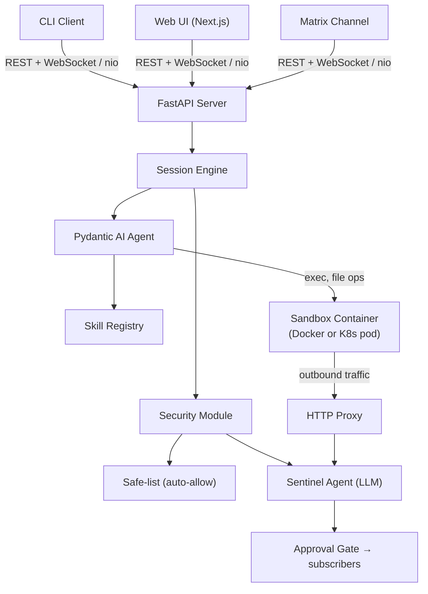

# Carapace

> **Disclaimer:** This is a pet project, born out of curiosity to
>
> - find out what hurdles arise when trying to build a "safe" OpenClaw,
> - see how far I can get by only assuming the reviewer / architect role, letting Cursor do the rest.

A security-first personal AI agent with LLM-powered security gating.

Carapace is a self-hosted AI agent gateway with a web UI and Matrix integration that lets you interact with an AI assistant from anywhere. Unlike other agent frameworks that start with broad access and lock down after the fact, Carapace starts with **zero access** and gates every capability through a dedicated **sentinel agent** -- an LLM that maintains a persistent security conversation, evaluating each action against a natural-language security policy (`SECURITY.md`).

## Key ideas

- **Sentinel agent, not permission matrices.** A dedicated LLM agent (the "sentinel") evaluates every non-trivial action against a human-readable `SECURITY.md` policy. It maintains a shadow conversation per session, building context over time for nuanced, intent-aware decisions.
- **Graduated trust.** The sentinel factors in the full session history -- previous approvals, user intent, time since last interaction -- to make proportional decisions. Early in a session or right after user confirmation, actions flow smoothly; after consuming untrusted data, scrutiny increases.
- **Strict veto semantics.** If any part of the security gate (safe-list bypass, sentinel, or user) flags an action for denial or approval, that decision is final. A compromised sentinel cannot override a deterministic denial.
- **Sandboxed execution.** Every agent action runs inside a sandboxed container (Docker or Kubernetes pod). All outbound traffic goes through an HTTP proxy that enforces per-session domain allowlisting. The sentinel evaluates unknown domains for plausibility.
- **Skills are trusted code.** A personal agent has access to so much of your data and life that running completely untrusted skills through it would be reckless. The user (or an LLM acting on their behalf) is responsible for reviewing skills before installing them. The security model protects against the agent being _influenced by outside data_ to misuse skills, not against malicious skills themselves.
- **Skills are portable.** Skills follow the open [AgentSkills](https://agentskills.io/) format (SKILL.md + scripts). They work in Claude Code, Cursor, Gemini CLI too. Carapace extends the format with `carapace.yaml` for network domain declarations and credential metadata, and optional `pyproject.toml` for Python dependencies (managed by uv).
- **The agent improves itself.** Carapace can write new skills, update its memory, and evolve its personality -- all gated by the same security system. No special "architect mode", just a sentinel that understands context.
- **Credentials stay in your vault.** Carapace is designed to fetch credentials from your password manager on demand with per-session approval. (Credential broker is [planned](docs/plans/credentials.md) — currently mock-only.)

## Demo

```text
$ carapace-server
INFO:     Carapace server ready — model=anthropic:claude-sonnet-4-5, skills=1, token=a1b2c3d4…

$ carapace
New session c72188b27225
Server: http://127.0.0.1:8321 | Type /help for commands

carapace> hi

Hello! I'm Carapace, your personal AI assistant. How can I help you today?

carapace> what can you do

I can help you with a variety of tasks:

File Management
 • Read, write, and edit files
 • Organize and manage documents

Command Execution
 • Run shell commands and scripts
 • Execute code and tools

Information & Research
 • Search the web for information
 • Look up facts and research topics

Memory
 • Remember important information about you and your preferences
 • Maintain context across our conversations

Task Planning
 • Break down complex tasks into steps
 • Help organize and execute multi-step projects

carapace> find out about your environment
  bash(command='ls -la')     [read_local] (shell)
  bash(command='uname -a')   [read_local] (shell)
  bash(command='pwd')        [read_local] (shell)

Here's what I found about the environment:

Location & System
 • Working directory: /home/user/carapace/data
 • OS: macOS (Darwin kernel, ARM64 - Apple Silicon)
 • Shell: zsh

Available Files & Directories
 • AGENTS.md, SOUL.md, USER.md - configuration files
 • config.yaml - system configuration
 • SECURITY.md - security policy
 • logs/, memory/, sessions/, skills/

Programming Languages Available
 • Python 3 (in virtual environment)
 • Node.js

carapace> ^D
Goodbye.
```

## Getting started

### Prerequisites

- **Docker** (required for sandbox execution in all setups)
- An **Anthropic API key** (set `ANTHROPIC_API_KEY` in `.env` or your environment)

### Configuration

1. Copy `.env.example` to `.env` and set your API key.
2. Set `CARAPACE_TOKEN` in `.env` — this is the bearer token used to authenticate CLI/frontend connections.
3. Customise files under `data/` — see [Data directory](#data-directory) below.

The web UI prompts for the server URL and token on first connect.

### Deployment with Docker Compose

Run the backend and frontend as containers:

```bash
# Build all images (server, frontend, sandbox)
docker compose build

# Start the server and frontend
docker compose up -d
```

The server is available at `http://localhost:8321`, the frontend at `http://localhost:3001`.

To connect via the CLI from the host:

```bash
uv run carapace --token "$CARAPACE_TOKEN"
```

## Architecture overview



The server runs the agent and all logic. The CLI, web UI, and Matrix are thin clients that connect via HTTP (sessions) and WebSocket (chat, slash commands, approval flow). Every tool call passes through the security module: safe operations (reads, memory, skill activation) are auto-allowed; everything else is evaluated by the sentinel agent. Network requests from sandbox containers are intercepted by an HTTP proxy and checked by the sentinel for domain plausibility.

See [docs/architecture.md](docs/architecture.md) for the full architecture with Mermaid diagrams.

## Core concepts

| Concept             | Description                                                    | Doc                                                            |
| ------------------- | -------------------------------------------------------------- | -------------------------------------------------------------- |
| Security            | Sentinel agent + SECURITY.md policy + action log               | [docs/security.md](docs/security.md)                           |
| Skills              | AgentSkills-compatible with uv-managed Python dependencies     | [docs/skills.md](docs/skills.md)                               |
| Sandbox             | Docker / Kubernetes sandboxed execution with HTTP proxy         | [docs/sandbox.md](docs/sandbox.md)                             |
| Sessions & Channels | Channel-decoupled persistent sessions (WebSocket, Matrix)      | [docs/sessions-and-channels.md](docs/sessions-and-channels.md) |
| Memory              | Markdown-based persistent memory with text search              | [docs/memory.md](docs/memory.md)                               |
| Kubernetes          | Helm chart, StatefulSet sandboxes, per-session PVCs, NetworkPolicy | [docs/kubernetes.md](docs/kubernetes.md)                       |

## Technology stack

- **Python 3.12+** with **Pydantic AI** (agents, tools, dependency injection)
- **FastAPI** + **uvicorn** for the server, **WebSockets** for real-time chat
- **Next.js 16** + **React 19** + **Tailwind CSS 4** for the web UI
- **matrix-nio** for Matrix integration
- **Docker** or **Kubernetes** for sandboxed tool execution
- **Pydantic v2** for config and models
- **Pydantic Logfire** for observability (OpenTelemetry)
- **uv** for packaging, **Docker Compose** for deployment

## Data directory

All state lives under `$CARAPACE_DATA_DIR` (defaults to `./data`).

```text
$CARAPACE_DATA_DIR/
  config.yaml            # main configuration
  SECURITY.md            # natural-language security policy (sentinel system prompt)
  AGENTS.md              # agent behavioral guide (seeded from built-in template)
  SOUL.md                # agent personality
  USER.md                # about the human
  skills/                # AgentSkills-format skill folders
  memory/                # Markdown-based persistent memory
  sessions/              # per-session history, state, audit logs, and workspace
```

## Comparison with OpenClaw

Carapace is inspired by [OpenClaw](https://docs.openclaw.ai/) but differs fundamentally in security philosophy:

- **OpenClaw** is perimeter-based: control who can talk to the bot, then trust the bot broadly.
- **Carapace** is flow-based: the bot starts untrusted and every capability is gated by a sentinel agent that tracks the full session context.

Other differences: Carapace is Python (not Node), uses Pydantic AI (not a custom agent loop), runs everything in sandboxed containers (not on the host), and uses the open AgentSkills format (not a custom skill system).

## Kubernetes deployment

Carapace supports Kubernetes as a sandbox runtime — sandbox sessions run as StatefulSets with per-session PVCs (via `volumeClaimTemplates`). On idle timeout the StatefulSet is scaled to 0 replicas (PVC retained, no venv rebuild on resume); on session deletion the PVC is cleaned up automatically. A [Helm chart](charts/carapace/) is included for deployment. See the [Kubernetes deployment guide](docs/kubernetes.md) for details and the [chart README](charts/carapace/README.md) for installation instructions.

## Development setup

For local development, run the backend and frontend directly instead of using Docker Compose:

```bash
# Install Python dependencies
uv sync

# Build the sandbox image (required — the server won't start without it)
docker compose build sandbox

# Start the backend
uv run carapace-server

# In another terminal — start the frontend (dev mode with hot reload)
cd frontend && pnpm install && pnpm dev

# In another terminal — connect via CLI
uv run carapace
```

Additional prerequisites: **Python 3.12+** (3.14 recommended), **[uv](https://docs.astral.sh/uv/)**, **Node.js 24+**, and **pnpm** (`corepack enable pnpm`) for the frontend.

## Status

In active development. Core features are working: client-server architecture with FastAPI + WebSocket, Next.js web frontend, Matrix channel, sentinel-gated tool execution, sandboxed containers (Docker + Kubernetes), HTTP proxy with domain allowlisting, skill system with uv-managed dependencies, and interactive CLI.

Planned features: [credential broker](docs/plans/credentials.md), [vector search for memory](docs/plans/memory.md), [task scheduling](docs/plans/channels.md), [Kubernetes enhancements](docs/plans/kubernetes.md).
