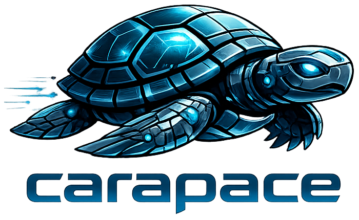
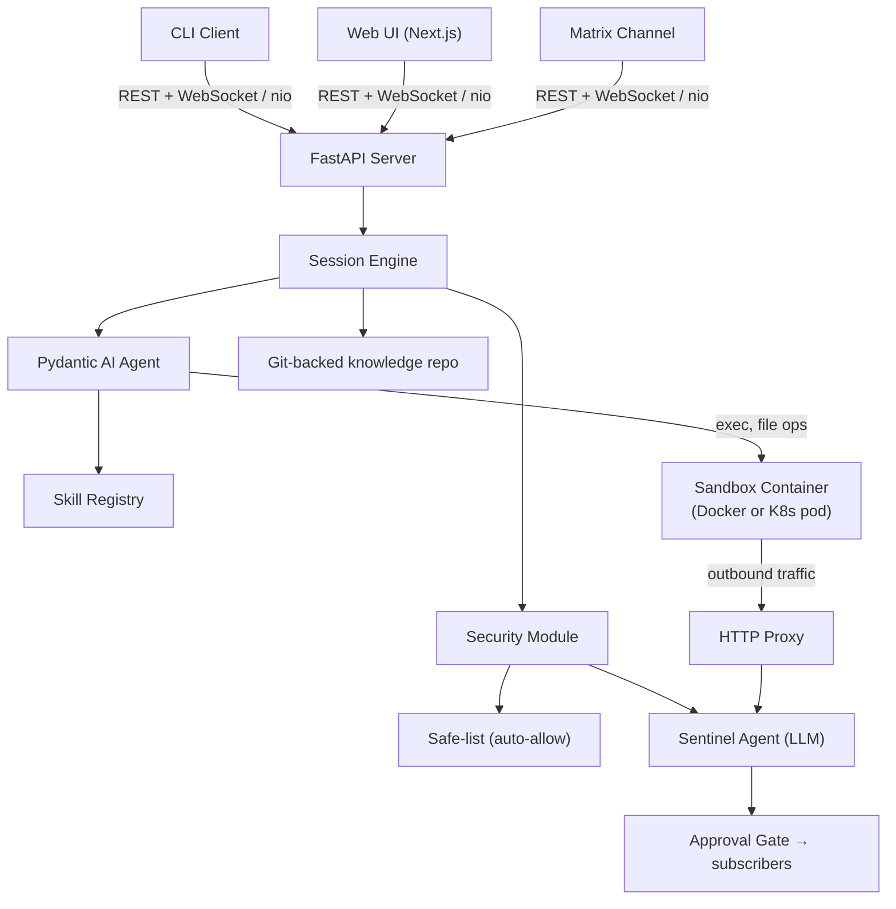

<p align="center">
  <a href="https://github.com/thiesgerken/carapace/actions/workflows/ci.yml"></a>
  <a href="https://github.com/thiesgerken/carapace/releases"></a>
  <a href="https://www.python.org/"></a>
  <a href="LICENSE"></a>
  <a href="charts/carapace/README.md"></a>
</p>

<p align="center">
  
</p>

<p align="center"><strong>A secure personal AI agent for DevOps engineers.</strong></p>

<p align="center">Zero trust. Git-backed knowledge. Full audit trail.</p>

<p align="center">
  <a href="docs/quickstart.md">Quickstart</a>
  ·
  <a href="docs/security.md">Security Model</a>
  ·
  <a href="docs/kubernetes.md">Kubernetes</a>
  ·
  <a href="charts/carapace/README.md">Helm Chart</a>
</p>

carapace is a self-hosted AI agent with a web UI, CLI, and Matrix channel for operators who want an assistant they can actually reason about. Every meaningful action is evaluated by a dedicated sentinel LLM against your natural-language policy in `SECURITY.md`, executed inside a sandbox, and recorded in an audit trail. Its memory is not hidden inside an app-specific database: personality, policy, skills, memory, and archived sessions live in a Git-backed knowledge repo you can inspect, diff, and sync.

## Highlights

- Sentinel-gated execution. Every non-trivial action is reviewed by a dedicated security agent that keeps session context, not a static allowlist spreadsheet.
- Kubernetes-ready sandboxes. Docker and Kubernetes runtimes are both supported, with StatefulSet-backed sandbox sessions, per-session PVCs, and idle-to-zero scaling already in place.
- Git-native knowledge repo. `SOUL.md`, `USER.md`, `SECURITY.md`, skills, memory, and archived sessions live in files you can inspect, diff, sync, and push upstream.
- No-direct-internet sandboxes. Sandbox workloads do not get ambient internet access; outbound traffic is forced through the proxy path.
- Proxy system with tunnels. HTTP traffic is mediated by the proxy, and exec-scoped tunnels cover non-HTTP protocols without leaving long-lived daemons behind.
- Context-scoped credentials. Secrets stay in your vault and are only injected or fetched on demand for exec calls that have the matching approved skill context.

## Knowledge Repo, Not Hidden State

carapace treats long-term agent state as a repository, not as an opaque internal store.

- The agent's policy lives in `SECURITY.md`.
- Its personality and user model live in `SOUL.md` and `USER.md`.
- Skills are plain files in AgentSkills format.
- Memory is markdown on disk.
- Session histories can be archived into the knowledge repo and pushed upstream.

That makes the system inspectable in a way most agent projects are not. You can review what changed, diff it, sync it, and audit how the agent's knowledge evolves over time.

## Security Model

- Sentinel agent evaluates every non-trivial action against a natural-language policy, not a rigid matrix of rules.
- Strict veto semantics apply: if the safe path, sentinel, or user says no, the action does not proceed.
- Sandboxed execution provides a hard boundary for file and process activity.
- Outbound traffic goes through a proxy, with domain plausibility checks and visible approval events.
- Domains, credentials, and tunnels are scoped to individual exec calls, so privileges do not accumulate across a long-running session.
- Credential access is session-aware and auditable, with a fast path only when a matching skill context explicitly covers it.
- Git pushes from the knowledge workflow are security-reviewed like other sensitive actions.

See [docs/security.md](docs/security.md), [docs/credentials.md](docs/credentials.md), and [docs/sandbox.md](docs/sandbox.md) for the full model.

## Getting Started

```bash
cp .env.example .env
# fill in ANTHROPIC_API_KEY and CARAPACE_TOKEN

docker compose build
docker compose up -d
```

This starts:

- Server at `http://localhost:8321`
- Frontend at `http://localhost:3001`

Optional CLI connection:

```bash
uv run carapace --token "$CARAPACE_TOKEN"
```

You can use whichever LLM backend fits your setup: hosted APIs, self-hosted `vllm`, `llama.cpp`, LM Studio, or anything else that exposes a compatible endpoint.

For the full Docker Compose setup, model configuration, credential backends, Matrix integration, and knowledge-repo configuration, see [docs/quickstart.md](docs/quickstart.md). For Kubernetes deployment, see [docs/kubernetes.md](docs/kubernetes.md) and [charts/carapace/README.md](charts/carapace/README.md).

## Architecture



The server runs the agent loop, session lifecycle, and security system. The CLI, web UI, and Matrix channel are thin clients. The knowledge repo is a first-class part of the design: session output can be promoted into Git-backed knowledge, and outbound Git operations are security-reviewed instead of treated as an afterthought.

See [docs/architecture.md](docs/architecture.md) for the fuller architecture breakdown.

## Core Docs

| Topic                                                          | What it covers                                                             |
| -------------------------------------------------------------- | -------------------------------------------------------------------------- |
| [docs/quickstart.md](docs/quickstart.md)                       | Docker Compose setup, credentials, Matrix, and initial configuration       |
| [docs/security.md](docs/security.md)                           | Sentinel policy model, audit trail, approvals, and veto semantics          |
| [docs/skills.md](docs/skills.md)                               | AgentSkills support, context-scoped access, providers, and command aliases |
| [docs/credentials.md](docs/credentials.md)                     | Vault-backed credentials, approval flow, and per-exec injection            |
| [docs/memory.md](docs/memory.md)                               | Markdown memory model and how it is loaded and searched                    |
| [docs/sandbox.md](docs/sandbox.md)                             | Docker/Kubernetes sandboxes, proxy behavior, and exec-scoped tunnels       |
| [docs/sessions-and-channels.md](docs/sessions-and-channels.md) | Session lifecycle, WebSocket events, Matrix behavior, and approvals        |
| [docs/kubernetes.md](docs/kubernetes.md)                       | Kubernetes runtime, StatefulSet sandboxes, and Helm deployment             |

## Kubernetes Deployment

carapace supports Kubernetes as a sandbox runtime. Sandboxes run as StatefulSets with per-session PVCs. On idle timeout the StatefulSet scales to zero while preserving persistent state, and on resume the sandbox is recreated with its committed knowledge and activated setup restored.

Use the included Helm chart in [charts/carapace](charts/carapace) and see [charts/carapace/README.md](charts/carapace/README.md) for installation details.

## Development

```bash
uv sync --dev
uv run pytest
pnpm --dir frontend install
pnpm --dir frontend lint
```

For local development without Docker Compose:

```bash
docker compose build sandbox
uv run carapace-server
pnpm --dir frontend dev
uv run carapace
```

Additional prerequisites: Python 3.12+, `uv`, Node.js 24+, and `pnpm`.

## Status

carapace is in active development, but the core system is already usable.

Shipped today:

- Sentinel-gated tool execution
- Web UI, CLI, and Matrix channels
- Docker and Kubernetes sandbox runtimes
- Git-backed knowledge repo with session archiving and upstream push support
- Context-scoped skill domains, credentials, and exec-scoped tunnels
- Credential broker with file and Bitwarden backends
- Session fork, sidebar controls, session attributes, and approval-source UI badges
- Token usage reporting, budgets, and runtime model switching

Planned next:

- [Vector search for memory](docs/plans/memory.md)
- [Scheduled tasks and cron-like channels](docs/plans/channels.md)
- [Further Kubernetes enhancements](docs/plans/kubernetes.md)

## Project Notes

- Heavy AI use during development: the frontend is vibecoded, the backend is reviewcoded, and the architectural and security decisions are manual.
- carapace is pre-1.0. Expect breaking changes before `1.0.0`.
- Batteries are not included. The point is to use the agent to build out your own skills and workflows.
- This is primarily a personal agent, published because other people may find it useful too.

## Contributing

Issues and pull requests are welcome. Before opening a PR, run the backend tests, frontend lint, and chart linting where relevant. The repo uses `prek` hooks and CI also covers tests, frontend lint, and Helm lint.

## License

MIT. See [LICENSE](LICENSE).

## Disclaimer

This is a pet project, born out of curiosity to:

- find out what hurdles arise when trying to build a safe personal agent,
- see how far I can get by only assuming the reviewer and architect role while letting Cursor do the rest.
