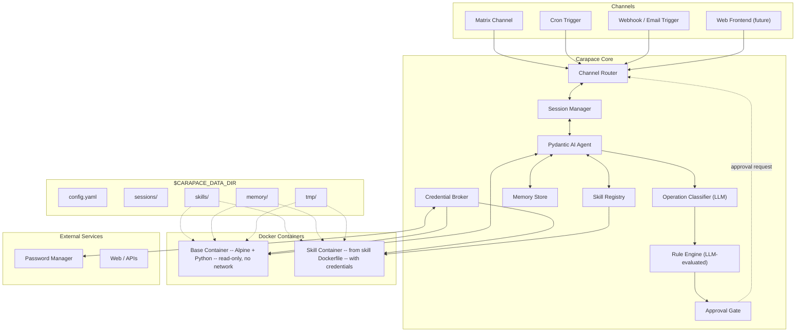
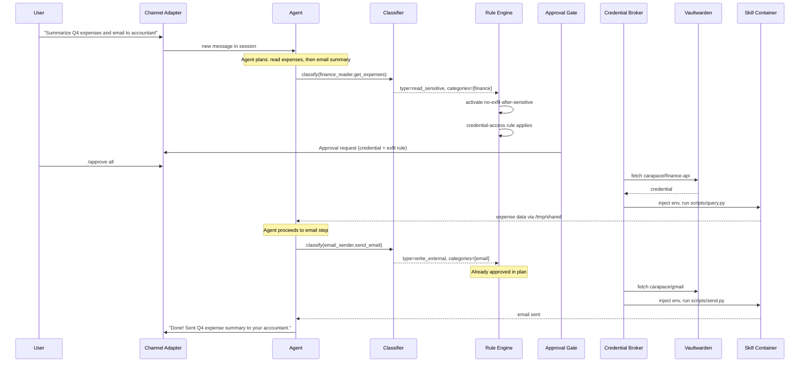

# Architecture

This document describes Carapace's high-level architecture, component responsibilities, data flow, deployment model, and configuration.

## High-level diagram



## Component responsibilities

### Channel Router

Receives inbound messages from all channel adapters and routes them to the Session Manager. On the outbound side, routes agent messages and approval requests back to the correct channel.

### Session Manager

Creates, resumes, and manages sessions. Each session tracks its own rule state (activated rules, disabled rules, approved credentials). The session is the core abstraction -- it is decoupled from any specific channel. See [sessions-and-channels.md](sessions-and-channels.md).

### Pydantic AI Agent

The main agent loop, built on [Pydantic AI](https://ai.pydantic.dev/). It receives messages from sessions, decides which tools/skills to invoke, generates plans, and produces responses. Tools are registered via Pydantic AI's tool and dependency injection system.

### Operation Classifier

A fast LLM call (Haiku-class model) that runs before every tool/skill invocation. It produces a structured classification of what the operation does (read/write, local/external, sensitive/routine, categories). This feeds into the Rule Engine. See [rules.md](rules.md) for details.

### Rule Engine

Evaluates plain-English security rules against the classified operation and the session's history. Determines which rules are activated, which apply, and whether the operation should proceed, be gated for approval, or be blocked. Uses an LLM for nuanced rule evaluation. See [rules.md](rules.md).

### Approval Gate

When the Rule Engine determines an operation needs approval, the Approval Gate sends a structured approval request through the session's channel and waits for a response (approve/deny). For non-interactive sessions (cron, webhook), approvals are routed to a configured interactive channel. See [sessions-and-channels.md](sessions-and-channels.md).

### Skill Registry

Loads skill metadata (name, description) from all skills at startup for the agent's catalog. Handles full skill activation (loading the complete SKILL.md body into context) when the agent decides a skill is relevant. Manages skill container lifecycle. See [skills.md](skills.md).

### Credential Broker

Fetches credentials from an external password manager on demand after per-session user approval. Credentials are injected into skill containers as environment variables and held in-memory only (never persisted to disk). See [credentials.md](credentials.md).

### Memory Store

Reads and writes Markdown-based memory files. Provides vector search over memory using local embeddings. Memory writes are rule-gated. See [memory.md](memory.md).

## Data flow example

This sequence shows what happens when a user asks: "Summarize Q4 expenses and email to accountant."



## Deployment

Carapace runs as a Docker container with the Docker socket mounted (to orchestrate child containers for tools and skills).

```yaml
# docker-compose.yaml
services:
  carapace:
    build: .
    volumes:
      - ./data:/data
      - /var/run/docker.sock:/var/run/docker.sock
    environment:
      - CARAPACE_DATA_DIR=/data
      - CARAPACE_LLM_API_KEY=${CARAPACE_LLM_API_KEY}
      - CARAPACE_VAULT_TOKEN=${CARAPACE_VAULT_TOKEN}
```

The `$CARAPACE_DATA_DIR` environment variable (defaults to `./data`) points to the data directory. All persistent state -- config, rules, skills, memory, sessions, logs -- lives there.

## Configuration

All configuration lives in `$CARAPACE_DATA_DIR/config.yaml`.

```yaml
carapace:
  log_level: info

channels:
  matrix:
    enabled: true
    homeserver: https://matrix.example.com
    user_id: "@carapace:example.com"
    device_name: carapace
    allowed_rooms: []
    allowed_users:
      - "@me:example.com"

  cron:
    enabled: false
    jobs:
      - id: daily-email-check
        schedule: "0 9 * * *"
        instructions: "Check my inbox for urgent emails and summarize."
        approval_target:
          channel: matrix
          dm: "@me:example.com"

agent:
  model: anthropic:claude-sonnet-4-5
  classifier_model: anthropic:claude-haiku

credentials:
  backend: vaultwarden
  vaultwarden:
    url: https://vault.example.com
    # auth token via CARAPACE_VAULT_TOKEN env var

sandbox:
  base_image: alpine:3.19
  idle_timeout_minutes: 15
  default_network: false

memory:
  search:
    enabled: true
    provider: local
    local_model: all-MiniLM-L6-v2

sessions:
  history_retention_days: 90
```

## Filesystem layout

```
$CARAPACE_DATA_DIR/
  config.yaml               # main configuration
  rules.yaml                # security rules
  AGENTS.md                 # master behavioral guide (loaded every session)
  SOUL.md                   # agent personality (evolvable)
  USER.md                   # about the human (learned over time)
  TOOLS.md                  # local environment notes
  HEARTBEAT.md              # periodic task checklist
  sessions/
    <session_id>/
      history.jsonl          # conversation log
      state.yaml             # activated rules, approved creds, etc.
  skills/
    <skill_name>/
      SKILL.md               # AgentSkills standard
      carapace.yaml          # optional: Carapace extensions
      Dockerfile             # optional: custom runtime
      scripts/
      references/
      assets/
  memory/
    CORE.md                  # curated long-term memory
    daily/
      YYYY-MM-DD.md
    topics/
      *.md
    .index/                  # vector search index (SQLite)
  tmp/                       # shared writable volume for containers
  logs/
    carapace.log
```

## Technology stack

| Component               | Technology                                      |
| ----------------------- | ----------------------------------------------- |
| Language                | Python 3.12+                                    |
| Agent framework         | Pydantic AI                                     |
| Matrix client           | matrix-nio (async, E2EE)                        |
| Config/models           | Pydantic v2                                     |
| Async runtime           | asyncio + uvloop                                |
| Container orchestration | Docker SDK for Python (docker-py)               |
| Password manager        | Bitwarden CLI / Vaultwarden API (pluggable)     |
| Vector search           | sentence-transformers (local), SQLite for index |
| Observability           | Pydantic Logfire (OpenTelemetry)                |
| Packaging               | pyproject.toml + uv                             |
| Deployment              | Docker Compose                                  |
