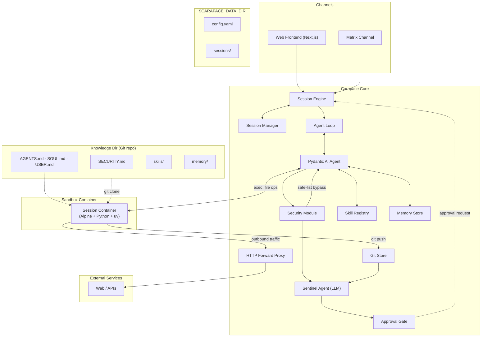
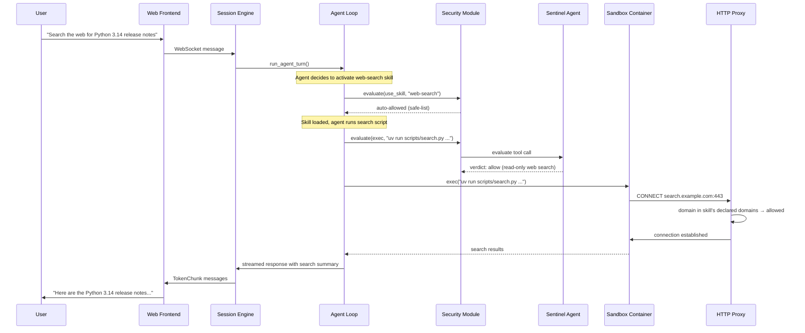

# Architecture

This document describes Carapace's high-level architecture, component responsibilities, data flow, deployment model, and configuration.

## High-level diagram


```mermaid
flowchart TB
    subgraph channels [Channels]
        WebUI["Web Frontend (Next.js)"]
        MatrixCh[Matrix Channel]
    end

    subgraph carapace [Carapace Core]
        SessionEngine[Session Engine]
        SessionMgr[Session Manager]
        SecurityMod["Security Module"]
        Sentinel["Sentinel Agent (LLM)"]
        ApprovalGate[Approval Gate]
        AgentLoop[Agent Loop]
        Agent["Pydantic AI Agent"]
        SkillRegistry[Skill Registry]
        MemoryStore[Memory Store]
        GitStore[Git Store]
        Proxy[HTTP Forward Proxy]
    end

    subgraph sandbox [Sandbox Container]
        Container["Session Container<br/>(Alpine + Python + uv)"]
    end

    subgraph external [External Services]
        Web[Web / APIs]
    end

    subgraph datadir ["$CARAPACE_DATA_DIR"]
        Config[config.yaml]
        Sessions[sessions/]
    end

    subgraph knowledgedir ["Knowledge Dir (Git repo)"]
        SecurityPolicy[SECURITY.md]
        WorkspaceFiles["AGENTS.md · SOUL.md · USER.md"]
        Skills[skills/]
        Memory[memory/]
    end

    WebUI & MatrixCh --> SessionEngine
    SessionEngine <--> SessionMgr
    SessionEngine --> AgentLoop
    AgentLoop <--> Agent
    Agent <--> SkillRegistry
    Agent <--> MemoryStore
    Agent --> SecurityMod
    SecurityMod -->|safe-list bypass| Agent
    SecurityMod --> Sentinel
    Sentinel --> ApprovalGate
    ApprovalGate -.->|approval request| SessionEngine

    Agent <-->|exec, file ops| Container
    Container -->|outbound traffic| Proxy
    Proxy --> Web
    Container -->|git push| GitStore
    GitStore --> Sentinel

    knowledgedir -.->|git clone| Container
    WorkspaceFiles -.-> Container
```

## Component responsibilities

### Session Engine

The central coordinator. Receives inbound messages from all channel subscribers (WebSocket, Matrix), manages session lifecycle, routes approval requests, runs agent turns, and broadcasts results back to subscribers. See [sessions-and-channels.md](sessions-and-channels.md).

### Session Manager

Handles session persistence — creating, loading, saving, listing, and deleting sessions on disk. Each session's state, history, events, usage, and audit trail are stored as YAML files under `$CARAPACE_DATA_DIR/sessions/<session_id>/`. (Note: `$CARAPACE_DATA_DIR` holds config and sessions only; knowledge files live in a separate Git-backed knowledge directory.)

### Agent Loop

Orchestrates a single agent turn: streams tokens to subscribers, handles the deferred tool approval cycle (when the sentinel escalates), records usage, and returns the final response. Implements the retry loop for `DeferredToolRequests`.

### Pydantic AI Agent

The main agent, built on [Pydantic AI](https://ai.pydantic.dev/). It receives messages from sessions, decides which tools/skills to invoke, and produces responses. Registered tools:

| Tool | Description |
| --- | --- |
| `list_skills` | List available skills (names + descriptions) |
| `use_skill` | Activate a skill: copy to sandbox, build venv, load instructions |
| `read` | Read a file or list a directory inside the sandbox |
| `write` | Write content to a file in the sandbox |
| `edit` | Search-and-replace edit of a file in the sandbox |
| `apply_patch` | Batch edits across multiple files in the sandbox |
| `exec` | Run a shell command in the sandbox (default timeout: 30s) |
| `read_memory` | Read a memory file or search memory |

Persistent writes (memory, skills, workspace files) happen via `git commit` + `git push` inside the sandbox. Each push is evaluated by the security sentinel through a pre-receive hook — there is no direct write tool.

### Security Module

The central security gate. Every tool call passes through `security.evaluate()`. A hardcoded safe-list auto-allows known-harmless operations. Everything else is forwarded to the sentinel agent. See [security.md](security.md).

### Sentinel Agent

An LLM-powered agent that evaluates actions against the natural-language `SECURITY.md` policy. Maintains a persistent "shadow conversation" per session, giving it full context of the session history. Returns structured verdicts (allow / escalate / deny). See [security.md](security.md).

### Approval Gate

When the sentinel escalates an operation, the agent loop sends a structured approval request to all session subscribers (WebSocket clients, Matrix rooms) and waits for a response (approve/deny). The request includes the sentinel's explanation and risk assessment.

### Skill Registry

Loads skill metadata (name, description) from each skill's `SKILL.md` frontmatter at startup. The full `SKILL.md` body is loaded only when the agent activates a skill. See [skills.md](skills.md).

### Memory Store

Reads Markdown-based memory files from the knowledge directory's `memory/` sub-folder. Provides case-insensitive text search over all memory files. The agent reads memory via the `read_memory` tool; writes happen through `git push` from the sandbox (see Git Store). See [memory.md](memory.md).

### Git Store

Manages the knowledge directory as a Git repository. Initialises the repo on startup, installs a pre-receive hook that gates every push through the sentinel, and optionally syncs with an external remote. Sandbox containers receive a Git clone of this repo as their `/workspace/`; the agent persists changes (memory, skills, workspace files) by committing and pushing back. See the "Server port architecture" table for the sandbox-facing Git HTTP backend on port 8322.

### HTTP Forward Proxy

An async forward proxy (HTTP + HTTPS CONNECT) running inside the Carapace server process. All outbound traffic from sandbox containers is routed through this proxy. It enforces per-session domain allowlisting with token-based authentication and delegates unknown domain requests to the security module for sentinel evaluation or user approval. See [sandbox.md](sandbox.md).

## Server port architecture

Carapace runs three separate listener ports for security isolation:

| Port | Bind address | Auth | Purpose |
| ---- | ------------ | ---- | ------- |
| 8321 (public API) | `0.0.0.0` | Bearer token | REST API, WebSocket — used by the frontend and CLI |
| 8322 (sandbox API) | `0.0.0.0` | HTTP Basic Auth (`session_id:token`) | Git HTTP backend — used by sandbox containers |
| 8320 (internal API) | `127.0.0.1` | None (loopback only) | Sentinel callback — used by the pre-receive hook |
| 3128 (proxy) | `0.0.0.0` | Proxy-Authorization Basic Auth | HTTP forward proxy — used by sandbox containers for outbound traffic |

Sandbox containers can only reach ports 3128 (proxy) and 8322 (sandbox API). The public API (8321) and internal API (8320) are unreachable from sandboxes — enforced by Docker's internal network or Kubernetes NetworkPolicy.

## Data flow example

This sequence shows what happens when a user asks: "Search the web for Python 3.14 release notes."


```mermaid
sequenceDiagram
    participant User
    participant Frontend as Web Frontend
    participant Engine as Session Engine
    participant Agent as Agent Loop
    participant Security as Security Module
    participant Sentinel as Sentinel Agent
    participant Sandbox as Sandbox Container
    participant Proxy as HTTP Proxy

    User->>Frontend: "Search the web for Python 3.14 release notes"
    Frontend->>Engine: WebSocket message
    Engine->>Agent: run_agent_turn()

    Note over Agent: Agent decides to activate web-search skill

    Agent->>Security: evaluate(use_skill, "web-search")
    Security-->>Agent: auto-allowed (safe-list)

    Note over Agent: Skill loaded, agent runs search script

    Agent->>Security: evaluate(exec, "uv run scripts/search.py ...")
    Security->>Sentinel: evaluate tool call
    Sentinel-->>Security: verdict: allow (read-only web search)

    Agent->>Sandbox: exec("uv run scripts/search.py ...")
    Sandbox->>Proxy: CONNECT search.example.com:443
    Proxy->>Proxy: domain in skill's declared domains → allowed
    Proxy->>Sandbox: connection established
    Sandbox-->>Agent: search results

    Agent->>Engine: streamed response with search summary
    Engine->>Frontend: TokenChunk messages
    Frontend->>User: "Here are the Python 3.14 release notes..."
```

## Deployment

Carapace runs as a Docker container with the Docker socket mounted (to orchestrate sandbox containers), alongside a Next.js web frontend.

```yaml
# docker-compose.yaml (simplified)
services:
  carapace:
    build: .
    volumes:
      - ./data:/data
      - /var/run/docker.sock:/var/run/docker.sock
    environment:
      - CARAPACE_DATA_DIR=/data
      - ANTHROPIC_API_KEY=${ANTHROPIC_API_KEY}
    ports:
      - "8321:8321"

  frontend:
    build: ./frontend
    ports:
      - "3001:3000"
```

For Kubernetes deployments, the Docker socket is replaced by in-cluster Kubernetes API access — see [kubernetes.md](kubernetes.md).

The `$CARAPACE_DATA_DIR` environment variable (defaults to `./data`) points to the data directory. All persistent state — config, security policy, workspace files, skills, memory, sessions — lives there.

## Configuration

Configuration lives in `$CARAPACE_DATA_DIR/config.yaml`. The default configuration (seeded on first run) sets only the LLM models:

```yaml
agent:
  model: "anthropic:claude-sonnet-4-6"
  sentinel_model: "anthropic:claude-haiku-4-5"
  title_model: "anthropic:claude-haiku-4-5"
  max_parallel_llm: 2
```

Additional configuration sections:

```yaml
carapace:
  log_level: info

server:
  host: "0.0.0.0"
  port: 8321          # public API (REST + WebSocket)
  sandbox_port: 8322   # sandbox-facing API (Basic Auth, Git HTTP)
  internal_port: 8320  # internal API (loopback only, sentinel callbacks)
  cors_origins: []

channels:
  matrix:
    enabled: false
    homeserver: https://matrix.example.com
    user_id: "@carapace:example.com"
    allowed_users:
      - "@me:example.com"

sandbox:
  runtime: docker           # "docker" or "kubernetes"
  base_image: carapace-sandbox:latest
  idle_timeout_minutes: 15
  proxy_port: 3128
  # Kubernetes-only settings (also available as CARAPACE_SANDBOX_* env vars):
  # k8s_namespace: carapace
  # k8s_session_pvc_size: 1Gi
  # k8s_session_pvc_storage_class: ""
```

LLM API keys are provided as standard environment variables (`ANTHROPIC_API_KEY`, `GOOGLE_API_KEY`, etc.) — not through the config file.
