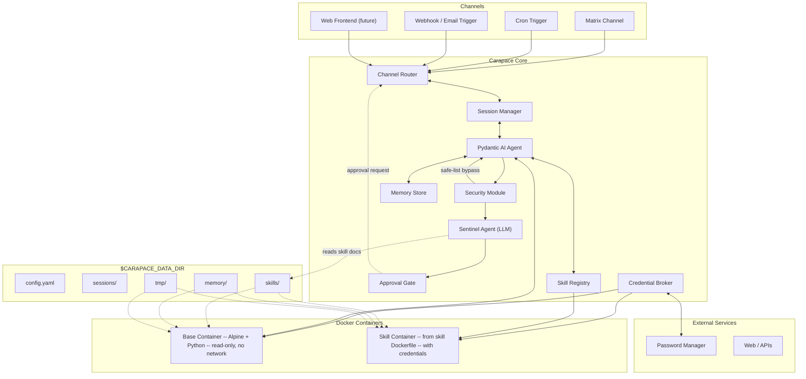
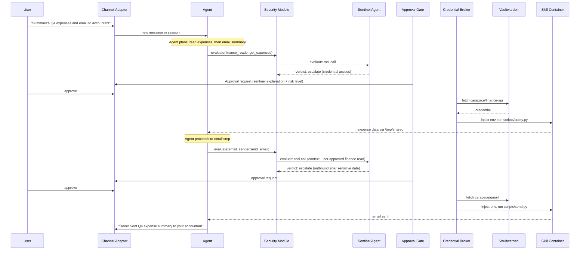

# Architecture

This document describes Carapace's high-level architecture, component responsibilities, data flow, deployment model, and configuration.

## High-level diagram


```mermaid
flowchart TB
    subgraph channels [Channels]
        MatrixCh[Matrix Channel]
        CronCh[Cron Trigger]
        WebhookCh[Webhook / Email Trigger]
        WebUI["Web Frontend (future)"]
    end

    subgraph carapace [Carapace Core]
        ChannelRouter[Channel Router]
        SessionMgr[Session Manager]
        SecurityMod["Security Module"]
        Sentinel["Sentinel Agent (LLM)"]
        ApprovalGate[Approval Gate]
        Agent[Pydantic AI Agent]
        SkillRegistry[Skill Registry]
        CredentialBroker[Credential Broker]
        MemoryStore[Memory Store]
    end

    subgraph docker [Docker Containers]
        BaseContainer["Base Container -- Alpine + Python -- read-only, no network"]
        SkillContainer["Skill Container -- from skill Dockerfile -- with credentials"]
    end

    subgraph external [External Services]
        Vault[Password Manager]
        Web[Web / APIs]
    end

    subgraph datadir ["$CARAPACE_DATA_DIR"]
        Config[config.yaml]
        Sessions[sessions/]
        Skills[skills/]
        Memory[memory/]
        Tmp[tmp/]
    end

    MatrixCh & CronCh & WebhookCh & WebUI --> ChannelRouter
    ChannelRouter <--> SessionMgr
    SessionMgr <--> Agent
    Agent <--> SkillRegistry
    Agent <--> MemoryStore
    Agent --> SecurityMod
    SecurityMod -->|safe-list bypass| Agent
    SecurityMod --> Sentinel
    Sentinel --> ApprovalGate
    ApprovalGate -.->|approval request| ChannelRouter
    Sentinel -.->|reads skill docs| Skills
    CredentialBroker <--> Vault
    CredentialBroker --> BaseContainer
    CredentialBroker --> SkillContainer
    Agent <--> BaseContainer
    SkillRegistry --> SkillContainer

    Skills -.-> BaseContainer
    Skills -.-> SkillContainer
    Memory -.-> BaseContainer
    Memory -.-> SkillContainer
    Tmp -.-> BaseContainer
    Tmp -.-> SkillContainer
```

## Component responsibilities

### Channel Router

Receives inbound messages from all channel adapters and routes them to the Session Manager. On the outbound side, routes agent messages and approval requests back to the correct channel.

### Session Manager

Creates, resumes, and manages sessions. Each session has an associated `SessionSecurity` object that holds the action log, sentinel conversation state, and audit log. The session is the core abstraction -- it is decoupled from any specific channel. See [sessions-and-channels.md](sessions-and-channels.md).

### Pydantic AI Agent

The main agent loop, built on [Pydantic AI](https://ai.pydantic.dev/). It receives messages from sessions, decides which tools/skills to invoke, generates plans, and produces responses. Tools are registered via Pydantic AI's tool and dependency injection system.

### Security Module

The central security gate. Every tool call passes through `security.evaluate()`. A hardcoded safe-list auto-allows known-harmless operations (reads, memory reads, skill listing). Everything else is forwarded to the sentinel agent. See [security.md](security.md).

### Sentinel Agent

An LLM-powered agent that evaluates actions against the natural-language `SECURITY.md` policy. Maintains a persistent "shadow conversation" per session, giving it full context of the session history. Has restricted tool access (can read skill directories but not the agent's workspace) and returns structured verdicts (allow / escalate / deny). See [security.md](security.md).

### Approval Gate

When the sentinel escalates an operation, the Approval Gate sends a structured approval request through the session's channel and waits for a response (approve/deny). The request includes the sentinel's explanation and risk assessment. For non-interactive sessions (cron, webhook), approvals are routed to a configured interactive channel. See [sessions-and-channels.md](sessions-and-channels.md).

### Skill Registry

Loads skill metadata (name, description) from all skills at startup for the agent's catalog. Handles full skill activation (loading the complete SKILL.md body into context) when the agent decides a skill is relevant. Manages skill container lifecycle. See [skills.md](skills.md).

### Credential Broker

Fetches credentials from an external password manager on demand after per-session user approval. Credentials are injected into skill containers as environment variables and held in-memory only (never persisted to disk). See [credentials.md](credentials.md).

### Memory Store

Reads and writes Markdown-based memory files. Provides vector search over memory using local embeddings. Memory writes are rule-gated. See [memory.md](memory.md).

## Data flow example

This sequence shows what happens when a user asks: "Summarize Q4 expenses and email to accountant."


```mermaid
sequenceDiagram
    participant User
    participant Channel as Channel Adapter
    participant Agent
    participant Security as Security Module
    participant Sentinel as Sentinel Agent
    participant Gate as Approval Gate
    participant CredBroker as Credential Broker
    participant Vault as Vaultwarden
    participant SkillCtr as Skill Container

    User->>Channel: "Summarize Q4 expenses and email to accountant"
    Channel->>Agent: new message in session

    Note over Agent: Agent plans: read expenses, then email summary

    Agent->>Security: evaluate(finance_reader.get_expenses)
    Security->>Sentinel: evaluate tool call
    Sentinel-->>Security: verdict: escalate (credential access)

    Gate->>Channel: Approval request (sentinel explanation + risk level)
    User->>Channel: approve

    CredBroker->>Vault: fetch carapace/finance-api
    Vault-->>CredBroker: credential
    CredBroker->>SkillCtr: inject env, run scripts/query.py
    SkillCtr-->>Agent: expense data via /tmp/shared

    Note over Agent: Agent proceeds to email step

    Agent->>Security: evaluate(email_sender.send_email)
    Security->>Sentinel: evaluate tool call (context: user approved finance read)
    Sentinel-->>Security: verdict: escalate (outbound after sensitive data)

    Gate->>Channel: Approval request
    User->>Channel: approve

    CredBroker->>Vault: fetch carapace/gmail
    CredBroker->>SkillCtr: inject env, run scripts/send.py
    SkillCtr-->>Agent: email sent

    Agent->>Channel: "Done! Sent Q4 expense summary to your accountant."
```

## Deployment

Carapace runs as a Docker container with the Docker socket mounted (to orchestrate child containers for tools and skills).

```yaml
# docker-compose.yaml
services:
  carapace:
    build: .
    volumes:
      - ./data:/data
      - /var/run/docker.sock:/var/run/docker.sock
    environment:
      - CARAPACE_DATA_DIR=/data
      - CARAPACE_LLM_API_KEY=${CARAPACE_LLM_API_KEY}
      - CARAPACE_VAULT_TOKEN=${CARAPACE_VAULT_TOKEN}
```

The `$CARAPACE_DATA_DIR` environment variable (defaults to `./data`) points to the data directory. All persistent state -- config, security policy, skills, memory, sessions, logs -- lives there.

## Configuration

All configuration lives in `$CARAPACE_DATA_DIR/config.yaml`.

```yaml
carapace:
  log_level: info

channels:
  matrix:
    enabled: true
    homeserver: https://matrix.example.com
    user_id: "@carapace:example.com"
    device_name: carapace
    allowed_rooms: []
    allowed_users:
      - "@me:example.com"

  cron:
    enabled: false
    jobs:
      - id: daily-email-check
        schedule: "0 9 * * *"
        instructions: "Check my inbox for urgent emails and summarize."
        approval_target:
          channel: matrix
          dm: "@me:example.com"

agent:
  model: anthropic:claude-sonnet-4-5
  sentinel_model: anthropic:claude-haiku

credentials:
  backend: vaultwarden
  vaultwarden:
    url: https://vault.example.com
    # auth token via CARAPACE_VAULT_TOKEN env var

sandbox:
  # base_image: ""  # leave empty to auto-build from bundled Dockerfile
  idle_timeout_minutes: 15
  default_network: false

memory:
  search:
    enabled: true
    provider: local
    local_model: all-MiniLM-L6-v2

sessions:
  history_retention_days: 90
```

## Filesystem layout

```text
$CARAPACE_DATA_DIR/
  config.yaml               # main configuration
  SECURITY.md               # natural-language security policy (sentinel system prompt)
  AGENTS.md                 # master behavioral guide (loaded every session)
  SOUL.md                   # agent personality (evolvable)
  USER.md                   # about the human (learned over time)
  TOOLS.md                  # local environment notes
  HEARTBEAT.md              # periodic task checklist
  sessions/
    <session_id>/
      history.jsonl          # conversation log
      state.yaml             # session state
      audit.jsonl            # security audit log (sentinel decisions)
  skills/
    <skill_name>/
      SKILL.md               # AgentSkills standard
      carapace.yaml          # optional: Carapace extensions
      Dockerfile             # optional: custom runtime
      scripts/
      references/
      assets/
  memory/
    CORE.md                  # curated long-term memory
    daily/
      YYYY-MM-DD.md
    topics/
      *.md
    .index/                  # vector search index (SQLite)
  tmp/                       # shared writable volume for containers
  logs/
    carapace.log
```

## Technology stack

| Component               | Technology                                      |
| ----------------------- | ----------------------------------------------- |
| Language                | Python 3.12+                                    |
| Agent framework         | Pydantic AI                                     |
| Matrix client           | matrix-nio (async, E2EE)                        |
| Config/models           | Pydantic v2                                     |
| Async runtime           | asyncio + uvloop                                |
| Container orchestration | Docker SDK for Python (docker-py)               |
| Password manager        | Bitwarden CLI / Vaultwarden API (pluggable)     |
| Vector search           | sentence-transformers (local), SQLite for index |
| Observability           | Pydantic Logfire (OpenTelemetry)                |
| Packaging               | pyproject.toml + uv                             |
| Deployment              | Docker Compose                                  |
