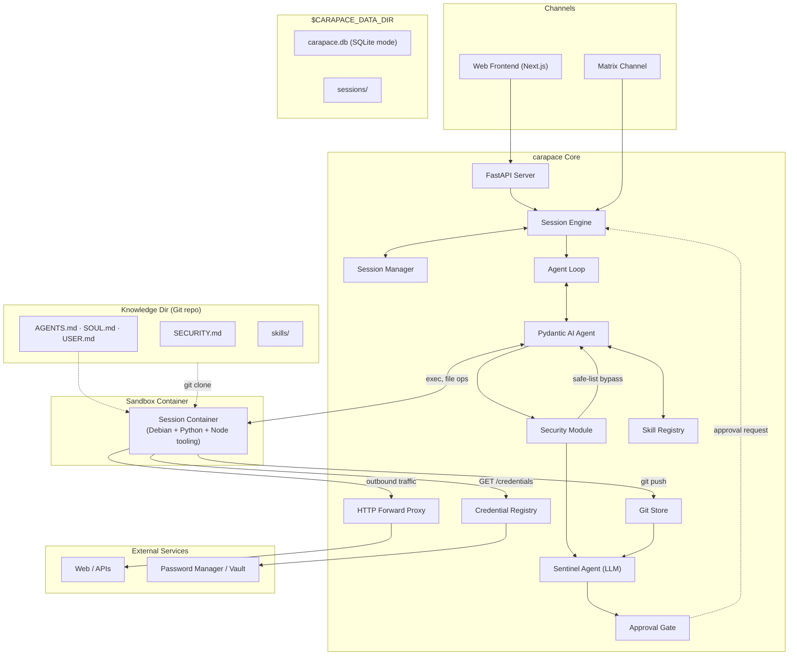
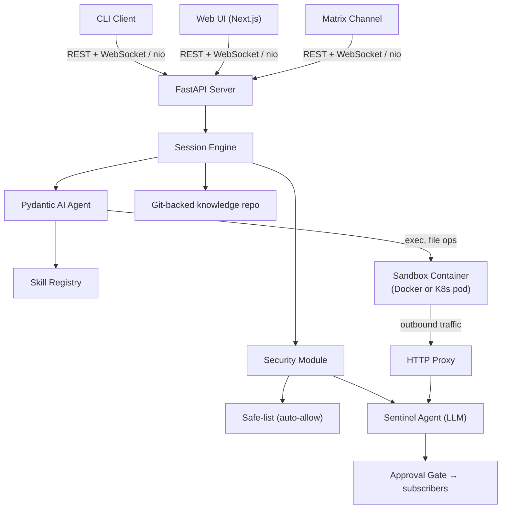
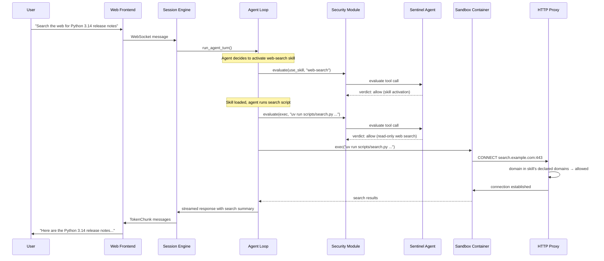

# Architecture

This document describes carapace's high-level architecture, component responsibilities, data flow, deployment model, and configuration.

## High-level diagram


```mermaid
flowchart TB
    subgraph channels [Channels]
        WebUI["Web Frontend (Next.js)"]
        MatrixCh[Matrix Channel]
    end

    subgraph carapace [carapace Core]
        Server[FastAPI Server]
        SessionEngine[Session Engine]
        SessionMgr[Session Manager]
        SecurityMod["Security Module"]
        Sentinel["Sentinel Agent (LLM)"]
        ApprovalGate[Approval Gate]
        AgentLoop[Agent Loop]
        Agent["Pydantic AI Agent"]
        SkillRegistry[Skill Registry]
        GitStore[Git Store]
        CredentialRegistry[Credential Registry]
        Proxy[HTTP Forward Proxy]
    end

    subgraph sandbox [Sandbox Container]
        Container["Session Container<br/>(Debian + Python + Node tooling)"]
    end

    subgraph external [External Services]
        Web[Web / APIs]
        Vault[Password Manager / Vault]
    end

    subgraph datadir ["$CARAPACE_DATA_DIR"]
        DBFile["carapace.db (SQLite mode)"]
        Sessions[sessions/]
    end

    subgraph knowledgedir ["Knowledge Dir (Git repo)"]
        SecurityPolicy[SECURITY.md]
        WorkspaceFiles["AGENTS.md · SOUL.md · USER.md"]
        Skills[skills/]
    end

    WebUI --> Server
    Server --> SessionEngine
    MatrixCh --> SessionEngine
    SessionEngine <--> SessionMgr
    SessionEngine --> AgentLoop
    AgentLoop <--> Agent
    Agent <--> SkillRegistry
    Agent --> SecurityMod
    SecurityMod -->|safe-list bypass| Agent
    SecurityMod --> Sentinel
    Sentinel --> ApprovalGate
    ApprovalGate -.->|approval request| SessionEngine

    Agent <-->|exec, file ops| Container
    Container -->|outbound traffic| Proxy
    Proxy --> Web
    Container -->|git push| GitStore
    Container -->|GET /credentials| CredentialRegistry
    CredentialRegistry --> Vault
    GitStore --> Sentinel

    knowledgedir -.->|git clone| Container
    WorkspaceFiles -.-> Container
```

## Compact overview

This is the smaller system diagram used in the README.


```mermaid
flowchart TD
    CLI["CLI Client"] & WebUI["Web UI (Next.js)"] & Matrix["Matrix Channel"]
    CLI & WebUI & Matrix -->|"REST + WebSocket / nio"| Server["FastAPI Server"]

    Server --> Engine[Session Engine]
    Engine --> Agent[Pydantic AI Agent]
    Engine --> Security[Security Module]
    Security --> SafeList["Safe-list (auto-allow)"]
    Security --> Sentinel["Sentinel Agent (LLM)"]
    Sentinel --> Gate["Approval Gate → subscribers"]

    Agent --> Skills[Skill Registry]
    Agent -->|"exec, file ops"| Sandbox["Sandbox Container\n(Docker or K8s pod)"]
    Sandbox -->|"outbound traffic"| Proxy[HTTP Proxy]
    Proxy --> Sentinel
    Engine --> Knowledge["Git-backed knowledge repo"]
```

## Component responsibilities

### FastAPI Server

The HTTP/WebSocket entry point. `src/carapace/server/__init__.py` is the public facade that exposes `app`, `sandbox_app`, and `main`, owns process startup/shutdown wiring, and keeps shared runtime state for compatibility with tests and route modules. Routes are split into focused modules: `server/auth.py` for cookie-session auth and admin user-management routes, `server/notifications.py` for notification and presence endpoints, `server/websocket.py` for chat WebSocket and small web-facing metadata routes, and `server/state.py` for accessing the mutable facade state from extracted routes.

### Session Engine

The central coordinator. Receives inbound messages from all channel subscribers (WebSocket, Matrix), manages session lifecycle, routes approval requests, runs agent turns, and broadcasts results back to subscribers. `session/engine.py` is now the lifecycle and dependency-wiring facade; model selection, slash commands, approvals, transcript helpers, turn execution, and usage/budget logic live in focused `session/` modules. See [sessions-and-channels.md](sessions-and-channels.md).

### Session Manager

Handles session persistence — creating, loading, saving, listing, and deleting sessions on disk. Each session's state, history, events, usage, and audit trail are stored as YAML files under `$CARAPACE_DATA_DIR/sessions/<session_id>/`. (Note: `$CARAPACE_DATA_DIR` holds config and sessions only; knowledge files live in a separate Git-backed knowledge directory.)

### Agent Loop

Orchestrates a single agent turn: streams tokens to subscribers, handles the deferred tool approval cycle (when the sentinel escalates), records usage, and returns the final response. Implements the retry loop for `DeferredToolRequests`.

### Pydantic AI Agent

The main agent, built on [Pydantic AI](https://ai.pydantic.dev/). It receives messages from sessions, decides which tools/skills to invoke, and produces responses. Registered tools:

| Tool          | Description                                                               |
| ------------- | ------------------------------------------------------------------------- |
| `list_skills` | List available skills (names + descriptions)                              |
| `use_skill`   | Activate a skill: prepare its sandbox runtime and load instructions       |
| `read`        | Read a file or list a directory inside the sandbox                        |
| `write`       | Write content to a file in the sandbox                                    |
| `str_replace` | Search-and-replace edit of a file in the sandbox                          |
| `exec`        | Run a shell command in the sandbox (default timeout: 30s)                 |

Persistent writes to workspace files, skills, and archived session snapshots happen via `git commit` + `git push` inside the sandbox. Each push is evaluated by the security sentinel through a pre-receive hook, so persistent knowledge changes do not bypass the sentinel.
Skill credential declarations in a skill's `SKILL.md` `metadata.carapace` frontmatter are evaluated during `use_skill`; approved credentials are fetched from the configured backend and cached before sandbox-provided activation runs. Core supplies the activator with the exact committed source revision. The official activator restores matching uv, npm, pnpm, and `setup.sh` inputs from that revision before execution.

### Security Module

The central security gate. Every tool call passes through `security.evaluate()`. A hardcoded safe-list auto-allows known-harmless operations. Everything else is forwarded to the sentinel agent. See [security.md](security.md).

### Sentinel Agent

An LLM-powered agent that evaluates actions against the natural-language `SECURITY.md` policy. Maintains a persistent "shadow conversation" per session, giving it full context of the session history. Returns structured verdicts (allow / escalate / deny). See [security.md](security.md).

### Approval Gate

When the sentinel escalates an operation, the agent loop sends a structured approval request to all session subscribers (WebSocket clients, Matrix rooms) and waits for a response (approve/deny). The request includes the sentinel's explanation and risk assessment.

### Skill Registry

Loads skill metadata (name, description) from each skill's `SKILL.md` frontmatter at startup. The full `SKILL.md` body is loaded only when the agent activates a skill. See [skills.md](skills.md).

### Git Store

Manages the knowledge directory as a Git repository. Initialises the repo on startup, installs a pre-receive hook that gates every push through the sentinel, and optionally syncs with an external remote. Sandbox containers receive a Git clone of this repo as their `/workspace/`; the agent persists changes by committing and pushing back. See the "Server port architecture" table for the sandbox-facing Git HTTP backend on port 8322.

### Credential Registry

Routes `vault_path` identifiers (`<backend>/<id>`) to named credential backends and provides three operations: `list(query)`, `fetch_metadata(vault_path)`, and `fetch(vault_path)`. Backends implement a small protocol (`file` and Bitwarden via `bw serve` are built in), including per-backend exposure rules (`expose` allowlist / `hide` blocklist).

Credential reads are sandbox-only: containers call `GET /credentials` and `GET /credentials/{vault_path}` on the sandbox API using their session token. The first per-session fetch triggers an approval request to channel subscribers; approved credentials are recorded in session state and access is appended to the action log as `credential_access` entries.

### HTTP Forward Proxy

An async forward proxy (HTTP + HTTPS CONNECT) running inside the carapace server process. All outbound traffic from sandbox containers is routed through this proxy. It enforces per-session domain allowlisting with token-based authentication and delegates unknown domain requests to the security module for sentinel evaluation or user approval. See [sandbox.md](sandbox.md).

## Python module map

This map describes the Python modules under `src/carapace/`. It is meant as a navigation aid for contributors; runtime data under `data/` and generated cache folders are not part of this map.

### Top-level package

| Module         | Responsibility                                                                                |
| -------------- | --------------------------------------------------------------------------------------------- |
| `__init__.py`  | Package version helper (`get_version`).                                                       |
| `__main__.py`  | `python -m carapace` entry point; delegates to the server CLI entry point.                    |
| `auth.py`      | File-backed users, password hashing, signed session cookies, and bootstrap admin handling.    |
| `bootstrap.py` | First-run data and knowledge directory seeding, including bundled knowledge files and skills. |
| `cache.py`     | In-memory cache for paginated session-list responses.                                         |
| `cli.py`       | Thin terminal client for REST and WebSocket session interaction.                              |
| `config.py`    | Configuration path resolution, YAML loading, and workspace-file loading helpers.              |
| `jobs.py`      | Job file persistence, cron scheduling, and job-run prompt construction.                       |
| `llm.py`       | Pydantic AI model factory and model settings helpers.                                         |
| `payloads.py`  | Defensive helpers for coercing untrusted payload shapes.                                      |
| `skills.py`    | Skill registry, frontmatter parsing, and carapace skill metadata loading.                     |
| `usage.py`     | Usage tracking, cost estimation, budget gauges, and LLM request activity records.             |
| `ws_models.py` | WebSocket protocol models and client-message parser.                                          |

### Agent package

| Module              | Responsibility                                                                                                                         |
| ------------------- | -------------------------------------------------------------------------------------------------------------------------------------- |
| `agent/__init__.py` | Re-exports agent creation and turn runner APIs.                                                                                        |
| `agent/deps.py`     | Pydantic AI dependency model injected into agent tools.                                                                                |
| `agent/loop.py`     | Channel-agnostic single-turn runner, streaming callbacks, and deferred tool approval retry loop.                                       |
| `agent/tools.py`    | Agent construction, system prompt assembly, and registered tools (`list_skills`, `use_skill`, `read`, `write`, `str_replace`, `exec`). |

### Channels package

| Module                          | Responsibility                                                                 |
| ------------------------------- | ------------------------------------------------------------------------------ |
| `channels/__init__.py`          | Channel adapter namespace.                                                     |
| `channels/matrix/__init__.py`   | Matrix channel package facade.                                                 |
| `channels/matrix/approval.py`   | Matrix approval tracking and decision constants.                               |
| `channels/matrix/channel.py`    | Matrix client lifecycle, sync loop, and message dispatch into `SessionEngine`. |
| `channels/matrix/commands.py`   | Matrix slash-command parsing and command response formatting.                  |
| `channels/matrix/formatting.py` | Matrix-safe text and event formatting helpers.                                 |
| `channels/matrix/subscriber.py` | `SessionSubscriber` implementation that sends engine events to Matrix rooms.   |

### Credentials package

| Module                     | Responsibility                                              |
| -------------------------- | ----------------------------------------------------------- |
| `credentials/__init__.py`  | Credential registry facade and builder exports.             |
| `credentials/bitwarden.py` | Bitwarden backend using a running `bw serve` API.           |
| `credentials/file.py`      | File-backed credential backend for local/dev secrets.       |
| `credentials/protocol.py`  | Backend protocols and shared credential backend types.      |
| `credentials/registry.py`  | Multi-backend credential registry and backend construction. |

### Git package

| Module            | Responsibility                                                           |
| ----------------- | ------------------------------------------------------------------------ |
| `git/__init__.py` | Git integration facade.                                                  |
| `git/http.py`     | Sandbox-facing Git Smart HTTP backend wrapper around `git http-backend`. |
| `git/store.py`    | Knowledge repo initialization, commit/push/pull, and hook management.    |

### Models package

| Module                  | Responsibility                                                         |
| ----------------------- | ---------------------------------------------------------------------- |
| `models/__init__.py`    | Compatibility facade re-exporting model types.                         |
| `models/config.py`      | Runtime configuration models and secret resolution.                    |
| `models/credentials.py` | Credential metadata, declarations, and registry protocol models.       |
| `models/jobs.py`        | Scheduled job configuration models.                                    |
| `models/session.py`     | Session state, attributes, budgets, job-run context, and audit models. |
| `models/skills.py`      | Skill catalog and carapace-specific skill metadata models.             |
| `models/tooling.py`     | Tool callback/result types and tool-argument normalization.            |

### Notifications package

| Module                      | Responsibility                                                    |
| --------------------------- | ----------------------------------------------------------------- |
| `notifications/__init__.py` | Notification facade exports.                                      |
| `notifications/models.py`   | Web push subscription, preference, delivery, and presence models. |
| `notifications/presence.py` | Short-lived active-client presence registry.                      |
| `notifications/router.py`   | Notification dispatch and clear-routing logic.                    |
| `notifications/sender.py`   | Web Push sender implementation.                                   |
| `notifications/store.py`    | Notification subscription persistence and owner-key derivation.   |
| `notifications/vapid.py`    | VAPID key generation, loading, and public-key derivation.         |

### Sandbox package

| Module                         | Responsibility                                                                             |
| ------------------------------ | ------------------------------------------------------------------------------------------ |
| `sandbox/__init__.py`          | Sandbox package namespace.                                                                 |
| `sandbox/container_scripts.py` | Python snippets executed inside sandboxes for setup and helper operations.                 |
| `sandbox/docker.py`            | Docker runtime implementation.                                                             |
| `sandbox/exec_flow.py`         | Exec orchestration, command metadata, context handling, and tunnel lifecycle coordination. |
| `sandbox/file_ops.py`          | Read/write/replace file operation helpers and size/window limits.                          |
| `sandbox/kubernetes.py`        | Kubernetes StatefulSet/PVC runtime implementation.                                         |
| `sandbox/manager.py`           | High-level sandbox session manager used by tools and server routes.                        |
| `sandbox/proxy.py`             | HTTP/HTTPS forward proxy with per-session domain authorization.                            |
| `sandbox/runtime.py`           | Abstract runtime protocol and shared sandbox runtime types.                                |
| `sandbox/session_lifecycle.py` | Container lifecycle state and ensure/cleanup/reload operations.                            |
| `sandbox/skill_activation.py`  | Skill activation, provider setup, command aliases, and credential materialization.         |
| `sandbox/state.py`             | Persisted sandbox snapshot models and load/save helpers.                                   |

### Security package

| Module                       | Responsibility                                                                    |
| ---------------------------- | --------------------------------------------------------------------------------- |
| `security/__init__.py`       | Public security evaluation API for tools, domains, credentials, and pushes.       |
| `security/context.py`        | Session security state, action log entries, approval records, and callback types. |
| `security/exec_allowlist.py` | Safe-list rules for low-risk shell commands.                                      |
| `security/sentinel.py`       | LLM-powered sentinel agent and persistent shadow conversation handling.           |

### Server package

| Module                    | Responsibility                                                                                                                        |
| ------------------------- | ------------------------------------------------------------------------------------------------------------------------------------- |
| `server/__init__.py`      | FastAPI app facade, startup/shutdown lifecycle, shared state, REST routes not yet split out, internal API, sandbox API, and `main()`. |
| `server/auth.py`          | Login/logout, cookie-session FastAPI dependencies, WebSocket auth, and admin user-management routes.                                  |
| `server/notifications.py` | Notification subscription, test, and presence routes.                                                                                 |
| `server/state.py`         | Helper for extracted route modules to access the mutable `carapace.server` facade.                                                    |
| `server/websocket.py`     | Chat WebSocket route, `WebSocketSubscriber`, and small web-facing metadata/model routes.                                              |

### Session package

| Module                       | Responsibility                                                                                                                   |
| ---------------------------- | -------------------------------------------------------------------------------------------------------------------------------- |
| `session/__init__.py`        | Session package facade.                                                                                                          |
| `session/approvals.py`       | Security approval callbacks, escalations, and tool-call event recording.                                                         |
| `session/archive.py`         | Session-to-knowledge archive/commit/delete service.                                                                              |
| `session/commands.py`        | Slash-command handling for `SessionEngine`.                                                                                      |
| `session/engine.py`          | Public session engine facade, lifecycle management, dependency wiring, subscribers, retry/reset/fork APIs, and title generation. |
| `session/manager.py`         | On-disk session persistence for state, history, events, usage, sandbox snapshots, and LLM activity.                              |
| `session/model_selection.py` | Available model catalog and per-session model override logic.                                                                    |
| `session/titler.py`          | Lightweight LLM title generation.                                                                                                |
| `session/transcript.py`      | Transcript/history helpers for retry, reset, fork, and unattended-output normalization.                                          |
| `session/turns.py`           | Agent-turn execution, cancellation/failure handling, and subscriber notifications.                                               |
| `session/types.py`           | Shared session runtime datatypes and `SessionSubscriber` protocol.                                                               |
| `session/usage_budget.py`    | Session budget parsing, gauges, usage payloads, and LLM activity recording.                                                      |

### Bundled skill modules

| Module                                                | Responsibility                                                              |
| ----------------------------------------------------- | --------------------------------------------------------------------------- |
| `assets/__init__.py`                                  | Resource package for bundled prompt/policy files and bundled skills.        |
| `assets/skills/example/src/example_skill/__init__.py` | Example skill package marker.                                               |
| `assets/skills/example/src/example_skill/hello.py`    | Example skill command demonstrating provider setup and exec-scoped tunnels. |
| `assets/skills/web/src/web_skill/__init__.py`         | Web skill package marker.                                                   |
| `assets/skills/web/src/web_skill/backends.py`         | Search backend protocol and Brave Search backend.                           |
| `assets/skills/web/src/web_skill/fetch.py`            | URL fetch and readable-content extraction CLI.                              |
| `assets/skills/web/src/web_skill/search.py`           | Web search CLI.                                                             |
| `assets/skills/wikipedia/src/wiki_skill/__init__.py`  | Wikipedia skill package marker.                                             |
| `assets/skills/wikipedia/src/wiki_skill/fetch.py`     | Wikipedia article fetch CLI.                                                |
| `assets/skills/wikipedia/src/wiki_skill/search.py`    | Wikipedia search CLI.                                                       |

## Server port architecture

carapace runs three separate listener ports for security isolation:

| Port                | Bind address | Auth                                 | Purpose                                                                               |
| ------------------- | ------------ | ------------------------------------ | ------------------------------------------------------------------------------------- |
| 8321 (public API)   | `0.0.0.0`    | HttpOnly session cookie              | REST API, WebSocket — used by the frontend and CLI                                    |
| 8322 (sandbox API)  | `0.0.0.0`    | HTTP Basic Auth (`session_id:token`) | Git HTTP backend + credential endpoints (`/credentials`) — used by sandbox containers |
| 8320 (internal API) | `127.0.0.1`  | None (loopback only)                 | Sentinel callback — used by the pre-receive hook                                      |
| 3128 (proxy)        | `0.0.0.0`    | Proxy-Authorization Basic Auth       | HTTP forward proxy — used by sandbox containers for outbound traffic                  |

Sandbox containers can only reach ports 3128 (proxy) and 8322 (sandbox API). The public API (8321) and internal API (8320) are unreachable from sandboxes — enforced by Docker's internal network or Kubernetes NetworkPolicy.

## Data flow example

This sequence shows what happens when a user asks: "Search the web for Python 3.14 release notes."


```mermaid
sequenceDiagram
    participant User
    participant Frontend as Web Frontend
    participant Engine as Session Engine
    participant Agent as Agent Loop
    participant Security as Security Module
    participant Sentinel as Sentinel Agent
    participant Sandbox as Sandbox Container
    participant Proxy as HTTP Proxy

    User->>Frontend: "Search the web for Python 3.14 release notes"
    Frontend->>Engine: WebSocket message
    Engine->>Agent: run_agent_turn()

    Note over Agent: Agent decides to activate web-search skill

    Agent->>Security: evaluate(use_skill, "web-search")
    Security->>Sentinel: evaluate tool call
    Sentinel-->>Security: verdict: allow (skill activation)

    Note over Agent: Skill loaded, agent runs search script

    Agent->>Security: evaluate(exec, "uv run scripts/search.py ...")
    Security->>Sentinel: evaluate tool call
    Sentinel-->>Security: verdict: allow (read-only web search)

    Agent->>Sandbox: exec("uv run scripts/search.py ...")
    Sandbox->>Proxy: CONNECT search.example.com:443
    Proxy->>Proxy: domain in skill's declared domains → allowed
    Proxy->>Sandbox: connection established
    Sandbox-->>Agent: search results

    Agent->>Engine: streamed response with search summary
    Engine->>Frontend: TokenChunk messages
    Frontend->>User: "Here are the Python 3.14 release notes..."
```

## Deployment

carapace runs as a Docker container with the Docker socket mounted (to orchestrate sandbox containers), alongside a Next.js web frontend.

```yaml
# docker-compose.yaml (simplified)
services:
  carapace:
    build: .
    volumes:
      - ./data:/data
      - /var/run/docker.sock:/var/run/docker.sock
    environment:
      - CARAPACE_DATA_DIR=/data
      - ANTHROPIC_API_KEY=${ANTHROPIC_API_KEY}
  frontend:
    build: ./frontend

  proxy:
    image: traefik:v3.6
    ports:
      - "3001:80"
```

For Kubernetes deployments, the Docker socket is replaced by in-cluster Kubernetes API access — see [kubernetes.md](kubernetes.md).

The `$CARAPACE_DATA_DIR` environment variable (defaults to `./data`) points to the runtime data directory. Runtime state — the SQL database (when using SQLite), auth secret, session files, notification state — lives there. There is no `config.yaml`: operator config comes from env vars and platform config from the database. Git-backed knowledge state lives under a per-user root at `data/knowledges/<normalized-user>/` in the default setup. Session owner determines which repo, skills tree, archive path, and sandbox clone URL are used.

## Configuration

Platform configuration (model catalog, agent/sentinel/title defaults, session budget, session-commit settings) is stored in the **database** (`models` + `platform_settings` tables) and edited from **Settings** -> **Admin** -> **Platform**. The built-in default model shape:

```yaml
agent:
  model: "anthropic:claude-sonnet-4-6"
  sentinel_model: "anthropic:claude-haiku-4-5"
  title_model: "anthropic:claude-haiku-4-5"
  default_session_budget: {}
  available_models:
    - "anthropic:claude-sonnet-4-6"
    - "anthropic:claude-haiku-4-5"
  max_parallel_llm: 2
```

Admins can update the model catalog, platform defaults, provider keys, and default session budget from the web UI. Users can override the default agent, sentinel, and title models plus their own default session budget from **Settings** -> **Account**. Those defaults apply to newly created web, Matrix, and non-persistent job sessions; existing sessions keep their current model overrides and budget.

OpenRouter is exposed as its own model provider. It uses Pydantic AI's `OpenRouterProvider`, including `OPENROUTER_API_KEY`, `OPENROUTER_APP_URL`, and `OPENROUTER_APP_TITLE` environment variable fallback. Example row:

```yaml
agent:
  available_models:
    - provider: openrouter
      name: anthropic/claude-sonnet-4.5
      api_key:
        env: OPENROUTER_API_KEY
```

Operator/bootstrap configuration comes entirely from **environment variables** (no config file). Each section maps to a prefix; nested fields use `__`:

| Section | Env prefix | Examples |
| --- | --- | --- |
| data root | `CARAPACE_DATA_DIR` | `CARAPACE_DATA_DIR=/var/lib/carapace` (knowledge repos live at `<data_dir>/knowledges`) |
| logging | `CARAPACE_` | `CARAPACE_LOG_LEVEL`, `CARAPACE_LOGFIRE_TOKEN` |
| database | `CARAPACE_DATABASE_` | `CARAPACE_DATABASE_URL` |
| cache | `CARAPACE_CACHE_` | `CARAPACE_CACHE_REDIS_URL` |
| server | `CARAPACE_SERVER_` | `CARAPACE_SERVER_PORT`, `CARAPACE_SERVER_CORS_ORIGINS` |
| auth cookie | `CARAPACE_AUTH_` | `CARAPACE_AUTH_COOKIE__SECURE=true`, `CARAPACE_AUTH_COOKIE__SAME_SITE` |
| notifications | `CARAPACE_NOTIFICATIONS_` | `CARAPACE_NOTIFICATIONS_VAPID_SUBJECT` |
| sandbox | `CARAPACE_SANDBOX_` | `CARAPACE_SANDBOX_RUNTIME`, `CARAPACE_SANDBOX_K8S_NAMESPACE` |

Session commit settings (DB-backed, edited via the Platform UI) control how conversation histories are copied into the knowledge repo:

- `sessions.commit.enabled`: master switch for the feature
- `sessions.commit.path_prefix`: subtree inside the knowledge repo where `conversation.json` files are written
- `sessions.commit.autosave_enabled`: enable the background inactivity-based commit sweep
- `sessions.commit.autosave_inactivity_hours`: inactivity threshold before a public session is auto-committed
- `sessions.commit.delete_from_knowledge_on_session_delete`: whether deleting a session also removes its current committed snapshot directory from the knowledge repo

LLM API keys are provided as standard environment variables (`ANTHROPIC_API_KEY`, `GOOGLE_API_KEY`, `OPENROUTER_API_KEY`, etc.) or configured on model rows that support per-row keys.

Credential backends are configured per user under `config.credentials`. Sandbox credential requests resolve the session
owner before listing or fetching credentials:

```yaml
users:
  alice:
    config:
      credentials:
        backends:
          personal:
            type: bitwarden
            url: http://127.0.0.1:8087
            basic_auth:
              username: alice
              password: user-specific-random-proxy-password
            expose:
              - "9742101e-68b8-4a07-b5b1-9578b5f88e6f"
```

File credential backends are ignored unless `CARAPACE_ALLOW_FILE_CREDENTIAL_BACKEND=true` is set on the server process.

### Secrets

Global config `Secret` fields, such as OpenAI-compatible and OpenRouter model API keys, support three sources:

```yaml
# Inline value (also accepts a plain string as shorthand)
api_key:
  raw: "my-secret-value"
api_key: "my-secret-value"  # equivalent shorthand

# Environment variable (raises if the variable is not set)
api_key:
  env: OPENAI_API_KEY

# File path (raises if the file does not exist)
api_key:
  file: /run/secrets/openai_api_key
```

Resolution priority: `raw` > `env` > `file`. Exactly one source should be set. `resolve()` returns a `SecretStr` and raises `ValueError` if the configured source is missing.

Secret fields are optional (`Secret | None`). When omitted, the feature that requires the secret is simply unavailable.

Scheduled jobs are configured separately in `$CARAPACE_DATA_DIR/jobs.yaml`; see [jobs.md](jobs.md).
