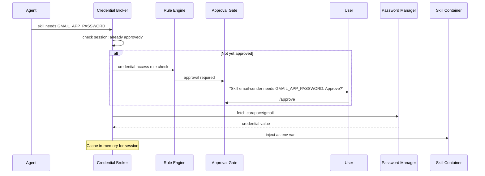

# Credential Management

Carapace does not store credentials itself. It uses an external password manager as the single source of truth and fetches credentials on demand with per-session user approval.

## System credentials

Only two credentials are needed by Carapace itself (stored as environment variables, not in the data directory):

- **LLM API token** (`CARAPACE_LLM_API_KEY`) -- for the agent and classifier models
- **Password manager auth** (`CARAPACE_VAULT_TOKEN`) -- for accessing the password manager API

## Skill credentials

Skills declare their credential needs in `carapace.yaml`:

```yaml
credentials:
  - name: GMAIL_APP_PASSWORD
    vault_path: "carapace/gmail"
    inject_as: env
    env_var: GMAIL_APP_PASSWORD
```

Each credential entry has:

| Field        | Description                                                                |
| ------------ | -------------------------------------------------------------------------- |
| `name`       | Identifier for the credential (used in approval prompts and session state) |
| `vault_path` | Path in the password manager                                               |
| `inject_as`  | How to inject: `env` (environment variable), `file`, or `stdin`            |
| `env_var`    | Environment variable name (when `inject_as: env`)                          |

## Credential flow



Step by step:

1. Skill declares it needs a credential
2. Credential Broker checks if this credential has been approved in the current session
3. If not, the `credential-access` rule fires (always-on), sending an approval request to the user
4. On approval, the Credential Broker fetches from the password manager
5. Credential is injected into the skill container's environment
6. Credential is cached **in-memory only** for the session (never written to disk by Carapace)
7. Credential access is recorded in session state, potentially activating other rules (e.g., `no-exfil-after-sensitive` if it's a finance credential)

## Security properties

- **No credential persistence**: Carapace never writes credentials to disk. They exist only in memory for the duration of a session.
- **Per-session approval**: Each credential must be approved the first time it's requested in a session. After `/reset`, all approvals are revoked.
- **Scoped injection**: Credentials are injected only into the specific skill container that needs them, not into the base container or other skill containers.
- **Audit trail**: Every credential access is logged in the session state and visible in Logfire traces.

## Password manager backends

The Credential Broker is pluggable. Supported backends:

| Backend                 | Integration                |
| ----------------------- | -------------------------- |
| Vaultwarden / Bitwarden | Via CLI (`bw`) or REST API |
| 1Password               | Via CLI (`op`)             |
| `pass`                  | Unix password store        |
| Environment variables   | Fallback for simple setups |

Configuration in `config.yaml`:

```yaml
credentials:
  backend: vaultwarden
  vaultwarden:
    url: https://vault.example.com
    # auth token via CARAPACE_VAULT_TOKEN env var
```
