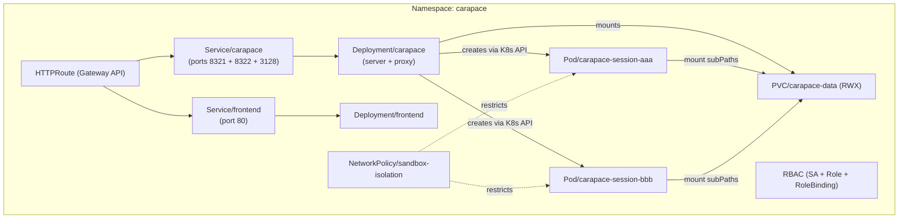

# Kubernetes Deployment

Carapace supports Kubernetes as a sandbox runtime. Instead of Docker containers, sandbox sessions run as Kubernetes pods that share a single RWX PersistentVolumeClaim for data.

## Prerequisites

- **Kubernetes cluster** — tested with k3s, works with any conformant cluster
- **RWX StorageClass** — CephFS, NFS, or another ReadWriteMany-capable provisioner. The server pod and all sandbox pods mount the same PVC.
- **Container images** pushed to a registry accessible by the cluster (GHCR by default)
- **Helm 3** installed locally

## Quick start

```bash
# 1. Create a secret with your API key and bearer token (or use an ExternalSecret / SealedSecret)
kubectl create namespace carapace
kubectl create secret generic carapace-secrets -n carapace \
  --from-literal=ANTHROPIC_API_KEY=sk-ant-... \
  --from-literal=CARAPACE_TOKEN=my-secret-token

# 2. Install from OCI registry, referencing the secret
helm install carapace oci://ghcr.io/thiesgerken/charts/carapace \
  --namespace carapace \
  --set ingress.hostname=carapace.example.com \
  --set 'envFrom[0].secretRef.name=carapace-secrets'

# 3. Upgrade to a new version
helm upgrade carapace oci://ghcr.io/thiesgerken/charts/carapace -n carapace
```

Inject additional config via `extraEnv` (inline values) or `envFrom` (external Secrets / ConfigMaps). The PVC uses the cluster's default StorageClass unless overridden with `persistence.storageClassName`.

See the [chart README](../charts/carapace/README.md) for installation details and the full values reference.

## Architecture



The server pod manages sandbox pods directly via the Kubernetes API. Each session gets its own pod running `sleep infinity`, with commands executed via `kubectl exec`. Sandbox pods are owned by the server Deployment (via `ownerReferences`), so they:

- Appear as children in ArgoCD's resource tree
- Are garbage-collected when the Deployment is deleted
- Don't cause OutOfSync warnings

## Configuration

Sandbox settings are configured via environment variables (prefix `CARAPACE_SANDBOX_`), not through `data/config.yaml`. This keeps deployment-specific settings separate from runtime data on the shared volume.

Set the following env vars on the server pod:

```yaml
env:
  - name: CARAPACE_SANDBOX_RUNTIME
    value: kubernetes
  - name: CARAPACE_SANDBOX_BASE_IMAGE
    value: ghcr.io/thiesgerken/carapace-sandbox:latest # pin this to a specific version!
  - name: CARAPACE_SANDBOX_K8S_NAMESPACE
    value: carapace
  - name: CARAPACE_SANDBOX_K8S_PVC_CLAIM
    value: carapace-data
  # - name: CARAPACE_SANDBOX_K8S_SERVICE_ACCOUNT
  #   value: ""  # optional SA for sandbox pods
```

When `CARAPACE_SANDBOX_RUNTIME` is unset or `docker` (the default), nothing changes — the server uses the Docker socket as before.

> **Important:** Always pin the sandbox image to a specific version tag (e.g. `:0.25.1`). Using `:latest` in production can lead to version mismatches between the server and sandbox image.

### Auto-detection

When the server runs inside Kubernetes (the `KUBERNETES_SERVICE_HOST` env var is set), it loads in-cluster credentials automatically. No `kubeconfig` needed.

### Environment variable reference

| Env var                                 | Default                   | Description                           |
| --------------------------------------- | ------------------------- | ------------------------------------- |
| `CARAPACE_SANDBOX_RUNTIME`              | `docker`                  | `docker` or `kubernetes`              |
| `CARAPACE_SANDBOX_BASE_IMAGE`           | `carapace-sandbox:latest` | Sandbox container image (pin version) |
| `CARAPACE_SANDBOX_IDLE_TIMEOUT_MINUTES` | `15`                      | Idle sandbox cleanup interval         |
| `CARAPACE_SANDBOX_PROXY_PORT`           | `3128`                    | HTTP proxy port for domain filtering  |
| `CARAPACE_SANDBOX_K8S_NAMESPACE`        | `carapace`                | Namespace for sandbox pods            |
| `CARAPACE_SANDBOX_K8S_PVC_CLAIM`        | `carapace-data`           | Shared PVC claim name                 |
| `CARAPACE_SANDBOX_K8S_SERVICE_ACCOUNT`  | `null`                    | ServiceAccount for sandbox pods       |
| `CARAPACE_SANDBOX_NETWORK_NAME`         | `carapace-sandbox`        | Docker network name (Docker only)     |

## Storage

A single RWX PVC (`carapace-data`) is shared between the server and all sandbox pods:

| Consumer    | Mount path             | subPath                           | Mode |
| ----------- | ---------------------- | --------------------------------- | ---- |
| Server      | `/data`                | (root)                            | RW   |
| Sandbox pod | `/workspace`           | `sessions/{sid}/workspace`        | RW   |

The `KubernetesRuntime` automatically translates the `SandboxManager`'s host-path mounts into PVC subPath references — no configuration needed.

## Networking

### Proxy

Sandbox pods reach the internet exclusively through the HTTP proxy running inside the server pod (port 3128). The proxy enforces per-session domain allowlisting with token-based auth. Sandbox pods receive **only** `HTTP_PROXY` / `HTTPS_PROXY` env vars pointing to the Carapace service.

Git operations (`git clone`, `git push`) use the **sandbox API** (port 8322) directly with HTTP Basic Auth (`session_id:token`). The sandbox API hostname is added to `NO_PROXY` so Git traffic bypasses the HTTP proxy.

The **internal API** (port 8320) is bound to `127.0.0.1` only and hosts the sentinel callback endpoint used by the pre-receive hook. It is unreachable from sandbox pods.

### NetworkPolicy

The included `networkpolicy.yaml` restricts sandbox pods:

- **Egress**: only to the server on ports 3128 (proxy) and 8322 (sandbox API) + DNS
- **Ingress**: only from the server pod (for exec)

This mirrors the Docker setup where sandbox containers are on an internal network with no direct internet access.

> **⚠️ SECURITY WARNING — NetworkPolicy is critical to Carapace's security model**
>
> Sandbox pods must **never** have direct internet access. All outbound traffic is forced through the server's HTTP proxy, which enforces per-session domain allowlisting and the human-in-the-loop approval flow. If a sandbox pod can reach the internet without going through the proxy, an agent can exfiltrate data or interact with external services without any approval.
>
> **The NetworkPolicy is the only thing preventing this.** If any of the following are true, the approval system can be trivially defeated:
>
> - Your CNI plugin does **not** enforce NetworkPolicy. k3s and distributions using Calico or Cilium support this out of the box. Standalone Flannel (the default in many vanilla clusters) silently ignores NetworkPolicy.
> - Another NetworkPolicy in the same namespace grants sandbox pods broader egress (Kubernetes NetworkPolicy is **additive** — a permissive policy cannot be overridden by a restrictive one).
> - Namespace-level or cluster-level network rules (e.g. Cilium `CiliumNetworkPolicy`, Calico `GlobalNetworkPolicy`) open additional egress paths for sandbox pods.
>
> **Before deploying to production**, verify your setup:
>
> ```bash
> # After deploying, exec into a sandbox pod and confirm it cannot reach the internet directly
> kubectl exec -it <sandbox-pod> -- curl -m 5 https://example.com
> # This MUST fail (timeout / connection refused). If it succeeds, your NetworkPolicy is not being enforced.
> ```

## RBAC

The server needs a ServiceAccount with permissions to manage pods in its namespace:

```yaml
rules:
  - apiGroups: [""]
    resources: ["pods", "pods/exec"]
    verbs: ["create", "get", "list", "delete"]
  - apiGroups: ["apps"]
    resources: ["deployments"]
    verbs: ["get"] # for ownerReference lookup
```

## ArgoCD

Sandbox pods are created at runtime and don't exist in Git. They appear in ArgoCD's resource tree as children of the server Deployment (via `ownerReferences`):

```text
Application: carapace
├── Deployment/carapace              ✅ Synced
│   ├── ReplicaSet/carapace-xxx      ✅
│   │   └── Pod/carapace-xxx-abc     ✅ Running (server)
│   ├── Pod/carapace-session-aaa     ✅ Running (sandbox)
│   └── Pod/carapace-session-bbb     ✅ Running (sandbox)
├── Deployment/frontend              ✅ Synced
├── Service/carapace                 ✅
└── PVC/carapace-data                ✅
```

No special ArgoCD configuration is needed — the standard annotation-based tracking handles it.

## Customization

- **StorageClass**: set `persistence.storageClassName` in your values (defaults to the cluster default)
- **Ingress**: the chart uses Gateway API `HTTPRoute`. Set `ingress.parentRefs` to match your Gateway.
- **Image tags**: pinned to `appVersion` by default; override with `image.tag`, `frontend.image.tag`, `sandbox.image.tag`
- **Resources**: sensible defaults are included; override `resources` / `frontend.resources` as needed
- **Priority class**: set `priorityClassName` to apply to all pods (server, frontend, sandbox)
- **PVC protection**: set `persistence.finalizers` to `["kubernetes.io/pvc-protection"]` to guard against accidental deletion

> **Future plans**: Per-session PVCs, StatefulSets for sandbox pods (scale down on idle), and git-backed storage for memory and skills. See [plans/kubernetes.md](plans/kubernetes.md).
