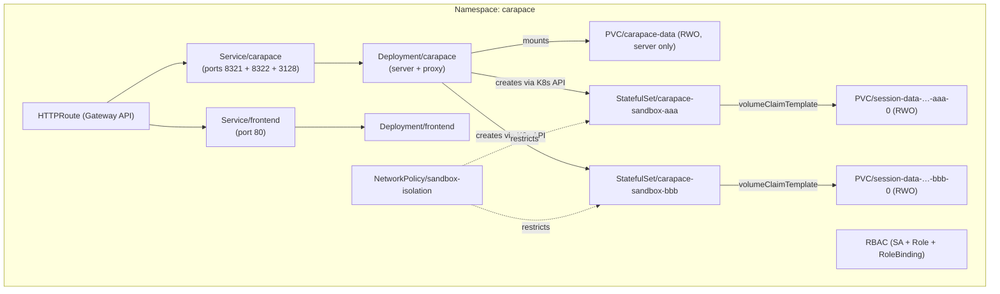

# Kubernetes Deployment

carapace supports Kubernetes as a sandbox runtime. Instead of Docker containers, sandbox sessions run as Kubernetes StatefulSets with per-session PVCs. Each session gets its own PersistentVolumeClaim via `volumeClaimTemplates`, eliminating the need for a shared RWX volume.

## Prerequisites

- **Kubernetes cluster** (1.27+) — tested with k3s, works with any conformant cluster. K8s 1.27+ is required for the `persistentVolumeClaimRetentionPolicy` feature (GA).
- **RWO StorageClass** — any standard ReadWriteOnce provisioner. The server pod has its own data PVC; sandbox sessions each get a dedicated PVC.
- **Container images** pushed to a registry accessible by the cluster (GHCR by default)
- **Helm 3** installed locally

## Quick start

```bash
# 1. Create a secret with your API key and bootstrap admin password (or use an ExternalSecret / SealedSecret).
#    The ANTHROPIC_API_KEY line is optional: drop it and the server still starts, so an admin can
#    configure the model catalog under Settings -> Admin -> Platform first.
kubectl create namespace carapace
kubectl create secret generic carapace-secrets -n carapace \
  --from-literal=ANTHROPIC_API_KEY=sk-ant-... \
  --from-literal=CARAPACE_TOKEN=my-bootstrap-admin-password

# 2. Create the Postgres credentials Secret (recommended; required under GitOps — see Database below)
kubectl create secret generic carapace-postgres -n carapace \
  --from-literal=postgres-password="$(openssl rand -base64 24)" \
  --from-literal=database-url='postgresql+psycopg://carapace@carapace-postgres:5432/carapace'

# 3. Install from OCI registry, referencing the secrets
helm install carapace oci://ghcr.io/thiesgerken/charts/carapace \
  --namespace carapace \
  --set ingress.hostname=carapace.example.com \
  --set 'envFrom[0].secretRef.name=carapace-secrets' \
  --set postgres.auth.existingSecret=carapace-postgres

# 4. Upgrade to a new version
helm upgrade carapace oci://ghcr.io/thiesgerken/charts/carapace -n carapace
```

> The `database-url` host (`carapace-postgres`) is `<release>-postgres`; the username
> (`carapace`) must match `postgres.auth.username`. The URL omits the password — it is
> injected separately as `PGPASSWORD` from `postgres-password`, so no URL-encoding is
> needed. With plain Helm you can skip step 2 and let the chart auto-generate the
> password, but do **not** do that under GitOps (see Database).

Inject additional environment variables via `extraEnv` (inline values) or `envFrom` (external Secrets / ConfigMaps). Platform and user settings are managed from the web UI after install; the server data PVC uses the cluster's default StorageClass unless overridden with `persistence.data.storageClassName`.

Session-list caching requires Redis. The Helm chart deploys an in-cluster Redis by default and wires `CARAPACE_CACHE_REDIS_URL` automatically; if you disable it, point carapace at an external Redis instance with `extraEnv` or `envFrom`.

Kubernetes credential backends can be deployed through the Helm chart too. For Bitwarden/Vaultwarden, the chart runs separately addressable vault proxies protected by HTTP Basic Auth and NetworkPolicy.

See the [chart README](../charts/carapace/README.md) for installation details and the full values reference.

## Architecture


```mermaid
graph TD
    subgraph ns ["Namespace: carapace"]
        Deploy["Deployment/carapace<br/>(server + proxy)"]
        Frontend["Deployment/frontend"]
        SvcServer["Service/carapace<br/>(ports 8321 + 8322 + 3128)"]
        SvcFront["Service/frontend<br/>(port 80)"]
        DataPVC["PVC/carapace-data (RWO, server only)"]
        NetPol["NetworkPolicy/sandbox-isolation"]
        Route["HTTPRoute (Gateway API)"]
        RBAC["RBAC (SA + Role + RoleBinding)"]
        StsA["StatefulSet/carapace-sandbox-aaa"]
        StsB["StatefulSet/carapace-sandbox-bbb"]
        PvcA["PVC/session-data-…-aaa-0 (RWO)"]
        PvcB["PVC/session-data-…-bbb-0 (RWO)"]
    end

    Deploy -->|mounts| DataPVC
    Deploy -->|creates via K8s API| StsA & StsB
    StsA -->|volumeClaimTemplate| PvcA
    StsB -->|volumeClaimTemplate| PvcB
    SvcServer --> Deploy
    SvcFront --> Frontend
    Route --> SvcServer & SvcFront
    NetPol -.->|restricts| StsA & StsB
```

The server pod manages sandbox StatefulSets directly via the Kubernetes API. Each session gets its own StatefulSet (replicas=1) with a per-session PVC created via `volumeClaimTemplates`. Commands are executed in the pod `{sts-name}-0` via `kubectl exec`.

Sandbox StatefulSets get an `ownerReference` so they show under the owning object in Argo CD and are garbage-collected when that object is deleted.

When `CARAPACE_SANDBOX_K8S_SANDBOXES_NAME` is set, the server requires that namespaced **`Sandboxes`** custom resource to exist and uses it as owner. If the named CR is missing or unavailable, sandbox creation fails.

Set `CARAPACE_SANDBOX_K8S_SANDBOXES_NAME` to `null` or an empty string to use the server `Deployment` (`CARAPACE_SANDBOX_K8S_SERVER_DEPLOYMENT_NAME`) as owner instead.

The `Sandboxes` CR is currently an ownership/metadata anchor only. There is no operator/controller reconciling sandbox resources yet; the carapace server still creates/scales/deletes sandbox StatefulSets directly.

Set **`CARAPACE_SANDBOX_K8S_OWNER_REF=false`** to omit `ownerReferences` entirely (Argo CD still associates sandboxes via `argocd.argoproj.io/tracking-id`).

### Idle lifecycle

When a session is idle (configurable timeout, default 60 min), the StatefulSet is scaled to **0 replicas**. The PVC is retained (`whenScaled: Retain`), preserving the workspace, skill venvs, and all session files. When the session resumes, the StatefulSet is scaled back to 1 replica — the pod mounts the existing PVC and is immediately ready (no git clone or venv rebuild needed).

If `CARAPACE_SANDBOX_WARM_POOL_SIZE` is greater than `0`, the server also keeps that many unattached generic warm sandboxes ready. New sessions can claim one of those prestarted StatefulSets instead of waiting for a full cold start. After a successful claim, carapace immediately refills the pool toward the configured target. The claimed sandbox keeps its original unique `sandbox_id` such as `pool-3f9c…`, which is persisted in the session snapshot and shown in the web UI's sandbox inspector.

When a session is permanently deleted (or the user runs `/reload`), the entire StatefulSet is deleted. The PVC is automatically cleaned up via the retention policy (`whenDeleted: Delete`).

## Configuration

All operator settings are configured via environment variables (there is no `config.yaml`); sandbox settings use the `CARAPACE_SANDBOX_` prefix. This keeps deployment-specific settings separate from UI-managed runtime data on the server PVC.

Set the following env vars on the server pod:

```yaml
env:
  - name: CARAPACE_SANDBOX_RUNTIME
    value: kubernetes
  - name: CARAPACE_SANDBOX_BASE_IMAGE
    value: ghcr.io/thiesgerken/carapace-sandbox:latest # pin this to a specific version!
  - name: CARAPACE_SANDBOX_WARM_POOL_SIZE
    value: "1" # keep one generic warm sandbox ready for faster claims (Helm: sandbox.warmPoolSize)
  - name: CARAPACE_SANDBOX_K8S_NAMESPACE
    value: carapace
  - name: CARAPACE_SANDBOX_K8S_PVC_CLAIM
    value: carapace-data
  # - name: CARAPACE_SANDBOX_K8S_SERVICE_ACCOUNT
  #   value: ""  # optional SA for sandbox pods
```

When `CARAPACE_SANDBOX_RUNTIME` is unset or `docker` (the default), nothing changes — the server uses the Docker socket as before.

The Helm chart sets the session-list cache URL automatically when bundled Redis is enabled. For an external Redis, configure `CARAPACE_CACHE_REDIS_URL` through `extraEnv` or `envFrom`:

```yaml
extraEnv:
  - name: CARAPACE_CACHE_REDIS_URL
    value: redis://redis.example.internal:6379/0
```

The bundled Redis Service name is `<release>-redis`, so the in-cluster URL is `redis://<release>-redis:6379/0`. If you set `redis.enabled=false`, provide an external Redis URL with `CARAPACE_CACHE_REDIS_URL`.

> **Important:** Always pin the sandbox image to a specific version tag (e.g. `:0.25.1`). Using `:latest` in production can lead to version mismatches between the server and sandbox image.

### Bitwarden / Vaultwarden credential backends

The chart can run Bitwarden CLI (`bw serve`) instances for the `bitwarden` credential backend. Each instance uses a Kubernetes Secret containing Bitwarden login material, mounted as files under `/run/secrets/bitwarden`:

```bash
kubectl create secret generic carapace-bw-personal -n carapace \
  --from-literal=BW_CLIENTID=user.xxxxxxxx-... \
  --from-literal=BW_CLIENTSECRET=xxxxxxxxxxxx \
  --from-literal=BW_MASTER_PASSWORD=your-master-password \
  --from-literal=BW_EMAIL=you@example.com
```

Each user can get a separate Service, Basic Auth boundary, Secret, and PVC. The Bitwarden CLI binds to a fixed localhost-only internal port (`8088`) inside its own Pod; nginx exposes the configured service port and the chart creates a NetworkPolicy that only allows ingress from the carapace server Pod. The service port defaults to `80` and must not be `8088`.

Create the proxy auth Secret separately. It must contain an htpasswd file named `htpasswd` unless you override `basicAuth.secretKey`:

```bash
htpasswd -nB alice > /tmp/carapace-bitwarden-alice-htpasswd
kubectl create secret generic carapace-bitwarden-alice-basic-auth -n carapace \
  --from-file=htpasswd=/tmp/carapace-bitwarden-alice-htpasswd
```

Then enable an instance with user-specific names in the Helm values:

```yaml
bitwarden:
  persistence:
    enabled: true
    size: 256Mi
    finalizers:
      - kubernetes.io/pvc-protection
  instances:
    - name: vaultwarden-alice
      fullnameOverride: carapace-bitwarden-alice
      serverUrl: https://vault.example.com
      existingSecret: carapace-bw-alice
      basicAuth:
        existingSecret: carapace-bitwarden-alice-basic-auth
```

Configure the matching Bitwarden backend in **Settings** -> **Account** -> **Credentials** for the owning user. The equivalent backing user config is:

```yaml
users:
  alice:
    config:
      credentials:
        backends:
          vault:
            type: bitwarden
            url: http://carapace-bitwarden-alice
            basic_auth:
              username: alice
              password: user-specific-random-proxy-password
```

Keep the username/password in the carapace user config aligned with the htpasswd entry in the proxy Secret. carapace redacts the proxy password from admin API responses, but the local `auth/users.yaml` still stores it so the server can authenticate to nginx.

See [credentials.md](credentials.md) for backend behavior, exposure controls, and credential access auditing.

### Auto-detection

When the server runs inside Kubernetes (the `KUBERNETES_SERVICE_HOST` env var is set), it loads in-cluster credentials automatically. No `kubeconfig` needed.

### Environment variable reference

| Env var                                          | Default                   | Description                                                |
| ------------------------------------------------ | ------------------------- | ---------------------------------------------------------- |
| `CARAPACE_SANDBOX_RUNTIME`                       | `docker`                  | `docker` or `kubernetes`                                   |
| `CARAPACE_SANDBOX_BASE_IMAGE`                    | `carapace-sandbox:latest` | Sandbox container image (pin version)                      |
| `CARAPACE_SANDBOX_SKILL_ACTIVATOR`               | unset                     | Absolute skill activator path; unset disables activation   |
| `CARAPACE_SANDBOX_SKILL_ACTIVATOR_TIMEOUT_SECONDS` | `600`                   | Whole-skill activator timeout                              |
| `CARAPACE_SANDBOX_IDLE_TIMEOUT_MINUTES`          | `60`                      | Idle sandbox cleanup interval                              |
| `CARAPACE_SANDBOX_WARM_POOL_SIZE`                | `0`                       | Number of generic warm sandboxes to keep ready             |
| `CARAPACE_SANDBOX_PROXY_PORT`                    | `3128`                    | HTTP proxy port for domain filtering                       |
| `CARAPACE_SANDBOX_K8S_NAMESPACE`                 | `carapace`                | Namespace for sandbox pods                                 |
| `CARAPACE_SANDBOX_K8S_PVC_CLAIM`                 | `carapace-data`           | Server data PVC claim name                                 |
| `CARAPACE_SANDBOX_K8S_SESSION_PVC_SIZE`          | `1Gi`                     | Per-session PVC size                                       |
| `CARAPACE_SANDBOX_K8S_SESSION_PVC_STORAGE_CLASS` | (cluster default)         | StorageClass for session PVCs                              |
| `CARAPACE_SANDBOX_K8S_SERVICE_ACCOUNT`           | `null`                    | ServiceAccount for sandbox pods                            |
| `CARAPACE_SANDBOX_K8S_OWNER_REF`                 | `true`                    | Attach `ownerReferences` to sandboxes                      |
| `CARAPACE_SANDBOX_K8S_SANDBOXES_NAME`            | `carapace-sandboxes`      | Required `Sandboxes` owner; set `null`/`""` for Deployment |
| `CARAPACE_SANDBOX_K8S_SERVER_DEPLOYMENT_NAME`    | `carapace`                | Server Deployment name (Helm sets to release name)         |
| `CARAPACE_SANDBOX_NETWORK_NAME`                  | `carapace-sandbox`        | Docker network name (Docker only)                          |

## Storage

The server uses a single RWO PVC (`carapace-data`) for its own data (config, sessions, knowledge repo). Sandbox sessions each get a dedicated RWO PVC via StatefulSet `volumeClaimTemplates`:

| Consumer            | Volume                                | Mount path   | Mode |
| ------------------- | ------------------------------------- | ------------ | ---- |
| Server              | `carapace-data` (RWO)                 | `/data`      | RW   |
| Sandbox StatefulSet | `session-data` (per-session PVC, RWO) | `/workspace` | RW   |
| Sandbox StatefulSet | `session-data` (per-session PVC, RWO) | `/tmp`       | RW   |

Sandbox pods have **no access** to the server's data PVC. The per-session PVC is mounted twice with `subPath`s (`workspace` and `tmp`) so workspace contents and temp files survive StatefulSet scale-down without a second claim. The workspace is populated via `git clone` from the server's Git HTTP backend on first start. Changes are persisted back via `git push`.

The per-session PVC size is configurable via `sandbox.sessionPvc.size` in the Helm values (default: 1Gi).

## Database

Relational state (users, sessions, jobs, auth sessions, sandbox tokens, notification
subscriptions) lives in a SQL database; schema migrations run automatically on server
startup. The chart deploys a bundled in-cluster PostgreSQL by default (`postgres.enabled`),
with an external-URL (`database.url`) or SQLite-on-the-data-PVC option. See the
[chart README — Database](../charts/carapace/README.md#database) for backend selection.

> **GitOps (Argo CD / Flux): set `postgres.auth.existingSecret`.** When `postgres.auth`
> has no password, the chart auto-generates one and reuses it across upgrades via a Helm
> `lookup`. `lookup` returns nothing under `helm template`, which is how Argo CD/Flux
> render manifests — so they regenerate a fresh random password on every sync. Postgres
> only sets the password at initdb, so the running DB keeps the old one and the server
> crashloops with `password authentication failed for user "carapace"`. Provide a stable
> Secret instead (SealedSecret / External Secrets) as in step 2 of the quick start, with
> keys `postgres-password` and `database-url`
> (`postgresql+psycopg://carapace@<release>-postgres:5432/carapace`, password omitted).

Runtime platform settings — the model catalog and scalar `agent`/`sessions` config edited in
the admin UI — also live in the database (`models` + `platform_settings` tables). A fresh DB
starts **empty**; until an admin configures the catalog, the server runs on the built-in
default models. The admin UI is the source of truth. Operator/bootstrap config
(`CARAPACE_DATA_DIR`, `CARAPACE_DATABASE_URL`, `CARAPACE_LOG_LEVEL`, `CARAPACE_SERVER_*`,
`CARAPACE_AUTH_*`, `CARAPACE_SANDBOX_*`, …) comes from env vars — there is no config file.

## Networking

### Proxy

Sandbox pods reach the internet exclusively through the HTTP proxy running inside the server pod (port 3128). The proxy enforces per-session domain allowlisting with token-based auth. Sandbox pods receive **only** `HTTP_PROXY` / `HTTPS_PROXY` env vars pointing to the carapace service.

Git operations (`git clone`, `git push`) use the **sandbox API** (port 8322) directly with HTTP Basic Auth (`session_id:token`). The sandbox API hostname is added to `NO_PROXY` so Git traffic bypasses the HTTP proxy.

The **internal API** (port 8320) is bound to `127.0.0.1` only and hosts the sentinel callback endpoint used by the pre-receive hook. It is unreachable from sandbox pods.

### NetworkPolicy

The included `networkpolicy.yaml` restricts sandbox pods:

- **Egress**: only to the server on ports 3128 (proxy) and 8322 (sandbox API) + DNS
- **Ingress**: only from the server pod (for exec)

This mirrors the Docker setup where sandbox containers are on an internal network with no direct internet access.

> **⚠️ SECURITY WARNING — NetworkPolicy is critical to carapace's security model**
>
> Sandbox pods must **never** have direct internet access. All outbound traffic is forced through the server's HTTP proxy, which enforces per-session domain allowlisting and the human-in-the-loop approval flow. If a sandbox pod can reach the internet without going through the proxy, an agent can exfiltrate data or interact with external services without any approval.
>
> **The NetworkPolicy is the only thing preventing this.** If any of the following are true, the approval system can be trivially defeated:
>
> - Your CNI plugin does **not** enforce NetworkPolicy. k3s and distributions using Calico or Cilium support this out of the box. Standalone Flannel (the default in many vanilla clusters) silently ignores NetworkPolicy.
> - Another NetworkPolicy in the same namespace grants sandbox pods broader egress (Kubernetes NetworkPolicy is **additive** — a permissive policy cannot be overridden by a restrictive one).
> - Namespace-level or cluster-level network rules (e.g. Cilium `CiliumNetworkPolicy`, Calico `GlobalNetworkPolicy`) open additional egress paths for sandbox pods.
>
> **Before deploying to production**, verify your setup:
>
> ```bash
> # After deploying, exec into a sandbox pod and confirm it cannot reach the internet directly
> kubectl exec -it <sandbox-pod> -- curl -m 5 https://example.com
> # This MUST fail (timeout / connection refused). If it succeeds, your NetworkPolicy is not being enforced.
> ```

## RBAC

The server needs a ServiceAccount with permissions to manage pods and StatefulSets in its namespace:

```yaml
rules:
  - apiGroups: [""]
    resources: ["pods", "pods/exec"]
    verbs: ["create", "get", "list", "delete"]
  - apiGroups: ["apps"]
    resources: ["deployments"]
    verbs: ["get", "list"] # Deployment fallback owner lookup
  - apiGroups: ["carapace.dev"]
    resources: ["sandboxes"]
    verbs: ["get", "list"]
  - apiGroups: ["apps"]
    resources: ["statefulsets", "statefulsets/scale"]
    verbs: ["create", "get", "list", "delete", "patch"]
  - apiGroups: [""]
    resources: ["persistentvolumeclaims"]
    verbs: ["get", "list", "delete"]
```

## ArgoCD

Sandbox StatefulSets are created at runtime and don't exist in Git. With a `Sandboxes` CR present in the workload namespace, sandboxes appear as children of that resource in the tree. If it is missing, they nest under the server Deployment (or appear as tracked resources via `argocd.argoproj.io/tracking-id` when owner refs are disabled).

```text
Sandboxes/carapace-sandboxes (or Deployment/carapace when Sandboxes CR missing)
├── StatefulSet/carapace-sandbox-aaa      ✅ (sandbox)
│   └── Pod/carapace-sandbox-aaa-0        ✅ Running
└── StatefulSet/carapace-sandbox-bbb      ✅ (sandbox, scaled to 0 = idle)
```

Labels and `argocd.argoproj.io/tracking-id` keep sandboxes associated with the app even without an `ownerReference`.

## Customization

- **StorageClass**: set `persistence.data.storageClassName`, `sandbox.sessionPvc.storageClass`, or `bitwarden.persistence.storageClassName` in your values (each defaults to the cluster default)
- **Ingress**: the chart uses Gateway API `HTTPRoute`. Set `ingress.parentRefs` to match your Gateway.
- **Image tags**: pinned to `appVersion` by default; override with `image.tag`, `frontend.image.tag`, `sandbox.image.tag`
- **Resources**: sensible defaults are included; override `resources` / `frontend.resources` as needed
- **Priority class**: set `priorityClassName` to apply to all pods (server, frontend, sandbox)
- **PVC protection**: set `persistence.data.finalizers` and `bitwarden.persistence.finalizers` to `["kubernetes.io/pvc-protection"]` to guard against accidental deletion
