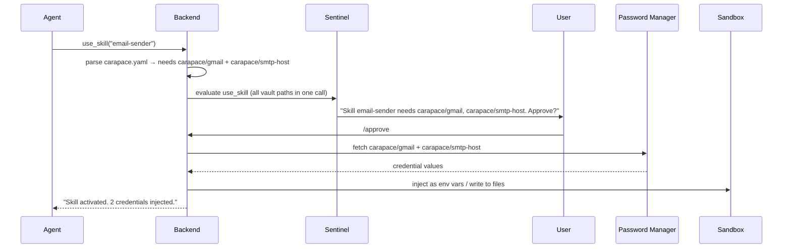
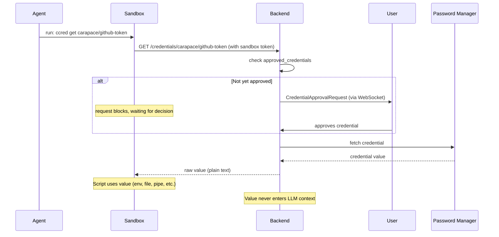

# Plan: Credential Management

> Status: planned. Currently only a `MockCredentialBroker` stub exists (unused). The credential system described below is the target design.

Carapace does not store credentials itself. It uses an external password manager as the single source of truth and exposes credentials to the sandbox via a REST endpoint that skill scripts pull from on demand.

## Design principle: pull, don't push

Instead of a complex broker that pushes credentials into containers, the backend exposes a simple HTTP endpoint on the same internal URL the sandbox already talks to for git operations. Skills fetch credentials themselves — the agent never sees raw values, and skill authors decide how to consume them (env var, file, pipe, etc.).

A built-in **credentials skill** documents this mechanism for the agent so it knows how to access and inject credentials when following a skill's instructions. It also provides a cli that does the relevant curl requests.

## Backend endpoints

New REST endpoints on the Carapace server (on the api that already hosts the git repo for the sandboxes), authenticated by the existing sandbox token:

### List / search credentials

```
GET /credentials
GET /credentials?q=gmail
Authorization: Bearer <SANDBOX_TOKEN>
```

Returns a JSON array of available credential names (and optionally vault paths) that match the query. **Does not return values** — only metadata. This lets the agent discover what credentials exist in the vault without exposing secrets.

Listing and searching are gated: the sentinel evaluates a `credential_list` action and can escalate. Two levels of approval are tracked per session:

- **`credential_list_all`**: approving an unfiltered `GET /credentials` grants access to all future list and search calls
- **`credential_search`**: approving a filtered `GET /credentials?q=...` only grants access to future searches, not unfiltered listing

A `credential_list_all` approval subsumes `credential_search` (but not vice versa).

### Fetch a credential

```
GET /credentials/{vault_path}
Authorization: Bearer <SANDBOX_TOKEN>
```

The server:

1. Identifies the session from the sandbox token
2. Checks whether this credential is already approved
3. If not yet approved, the request **blocks** — the server sends a `CredentialApprovalRequest` to the user via WebSocket and holds the HTTP connection open until a decision arrives
4. If the user **approves**, the server fetches the credential from the configured vault backend and returns it
5. If the user **denies**, the server returns `403`
6. Logs a `CredentialAccessEntry` to the session's action log
7. Returns the raw value in the response body (plain text, not JSON — easy to capture with `curl`)

From the caller's perspective the request either succeeds (with a possible delay while the user decides) or fails with `403` if denied. No retry loop needed.

The credential value passes through the server's memory but is **never written to disk or logged**.

## Skill credential declarations

Skills declare their credential needs in `carapace.yaml`:

```yaml
credentials:
  - vault_path: "carapace/gmail"
    env_var: GMAIL_APP_PASSWORD
  - vault_path: "carapace/ssh/deploy-key"
    file: /home/sandbox/.ssh/id_ed25519
```

Each credential entry has:

| Field        | Description                                                                  |
| ------------ | ---------------------------------------------------------------------------- |
| `vault_path` | Path in the password manager (also the identifier shown in approval prompts) |
| `env_var`    | Inject as this environment variable on skill activation (optional)           |
| `file`       | Write to this file path inside the sandbox on skill activation (optional)    |

`vault_path` is the canonical identifier — it is what gets shown to the user in approval prompts and stored in `approved_credentials`.

### Auto-injection on skill activation

When `use_skill` activates a skill whose `carapace.yaml` declares credentials with `env_var` or `file`:

1. The server collects all declared vault paths from `carapace.yaml`
2. Any already-approved credentials are skipped
3. The remaining ones are sent to the sentinel as a **single evaluation** — all vault paths are included in the gate args together
4. If the sentinel escalates, the user sees **one approval prompt** listing all requested credentials (not one per credential)
5. On approval, the backend fetches all credentials from the vault in one pass
6. For `env_var` entries: values are injected as environment variables into the sandbox container for subsequent `exec()` calls
7. For `file` entries: values are written to the specified path inside the sandbox container with mode `0400` (read-only by owner — the agent can `chmod` if needed)
8. The agent and LLM never see the credential values — they are passed directly into the container runtime

This covers the common cases (API keys as env vars, SSH keys as files). For anything more dynamic, the skill's instructions can tell the agent to use the REST endpoint or `ccred` CLI directly.

The on-demand `ccred get` flow from inside the sandbox is always single-credential — `ccred` retries in a loop internally until the credential is approved or the command times out. The agent should explain to the user what it needs before running the command.

## Credential flow

### Auto-injection (via `carapace.yaml`)



### On-demand fetch (via REST endpoint)



## Built-in credentials skill

A built-in skill (`credentials`) teaches the agent how the credential system works. Its `SKILL.md` documents:

- How to read a skill's `carapace.yaml` to discover required credentials
- That credentials declared with `env_var` or `file` are auto-injected when the skill is activated
- How to list available credentials: `ccred list` or `ccred list -q gmail` (the request blocks until the user approves on first use)
- How to fetch a credential: `ccred get carapace/gmail` (blocks until approved, then prints to stdout)
- How to write a credential to a file: `ccred get carapace/ssh/key -o ~/.ssh/id_ed25519`
- How to inject a fetched value as an env var: `export TOKEN=$(ccred get carapace/github-token)`
- That credential values must **never** be echoed, printed, or passed back to the agent
- That requests block while the user is deciding — the agent should tell the user what it needs **before** running the `ccred` command

This way the agent learns the credential workflow from the skill's instructions — no special tool needed.

## Security properties

- **Credentials never enter LLM context**: Values stay inside the sandbox process. The agent orchestrates but never sees raw secrets.
- **No credential persistence**: The server never writes credentials to disk. They exist only in memory for the duration of a request.
- **Per-session approval**: Each credential must be approved the first time it is requested in a session. Approval is all-or-nothing for bundled requests (skill activation) — the user cannot partially approve a bundle. After `/reset`, all approvals are revoked. There is no mid-session revocation: once a credential has been injected into the sandbox, the value may have been copied elsewhere inside the container, so revoking access would be cosmetic.
- **Sentinel evaluation**: Credential access (both auto-injection and on-demand) is visible to the sentinel — it sees the credential names in tool args or shell commands and can escalate/deny.
- **Audit trail**: Every credential access is logged as a `CredentialAccessEntry` in the session action log and visible in Logfire traces.
- **Sandbox-scoped**: The REST endpoint is only reachable from inside the sandbox (authenticated by sandbox token). The credential is delivered to the container, not to the agent.

## UI: session credential visibility

The frontend displays credential state for the active session:

- **Session info panel**: Shows the list of approved credentials alongside existing fields (activated skills, allowed domains). Each credential shows its name and approval status.
- **Approval cards**: When credential approval is needed, a `CredentialApprovalCard` component renders — same pattern as domain-access and git-push approval cards. The card displays a **list of vault paths** being requested (not just one), so the user can review the full bundle before approving. For single on-demand fetches the list has one entry; for skill activation it may have several. The user approves or denies the entire bundle.
- **`/session` command**: Already returns `approved_credentials` — the frontend `CommandResultView` renders them in the session info display.

### WebSocket messages

- New `CredentialApprovalRequest` server message:
  ```typescript
  {
    type: "credential_approval_request",
    vault_paths: string[],       // one or more credentials being requested
    skill_name?: string,         // set when triggered by skill activation
    explanation: string
  }
  ```
- Response from the frontend:
  ```typescript
  {
    type: "credential_approval_response",
    vault_paths: string[],       // echoes the requested paths
    decision: "approved" | "denied"
  }
  ```
- The existing `StatusUpdate` or a new `SessionStateUpdate` message can push credential approvals to the UI in real-time so the session info panel stays current.

## Password manager backends

Supported backends:

| Backend                 | Integration                |
| ----------------------- | -------------------------- |
| Vaultwarden / Bitwarden | Via REST API               |
| 1Password               | Via CLI (`op`) or Connect  |
| `pass`                  | Unix password store        |
| Environment variables   | Fallback for simple setups |

Start with a single backend. Multiple backends (prefix-based routing, per-backend exposure rules) can be added later without rearchitecting — the vault interface stays the same, the server just dispatches to different instances based on vault path prefix.

The env-var backend is the natural starting point (zero dependencies). It resolves `vault_path` like `carapace/gmail` to an env var `CARAPACE_VAULT_CARAPACE_GMAIL` (uppercased, slashes replaced with underscores) on the server side.

### Exposure control

The vault config includes an allowlist or blocklist of vault path patterns that Carapace is permitted to access. This is a hard boundary enforced **before** the sentinel — if a credential doesn't match the exposure rules, the server rejects the request immediately without consulting the sentinel or prompting the user.

This lets users connect a password manager that holds hundreds of unrelated secrets while only exposing the handful that are relevant to Carapace. The sentinel provides contextual, per-session gating on top; exposure control provides a static, config-level boundary underneath.

Rules use glob patterns matched against `vault_path`:

- **`expose`** (allowlist mode): only matching paths are accessible. Default if specified.
- **`hide`** (blocklist mode): matching paths are excluded, everything else is accessible.

If neither is specified, all credentials in the vault are accessible (sentinel-only gating).

Configuration in `config.yaml`:

```yaml
credentials:
  backend: env # or "vaultwarden", "1password", "pass"
  expose:
    - "carapace/*" # everything under carapace/
    - "shared/api-keys/*" # plus shared API keys
  # OR alternatively:
  # hide:
  #   - "personal/*"
  #   - "work/banking/*"
  vaultwarden:
    url: https://vault.example.com
    # auth token via CARAPACE_VAULT_TOKEN env var
```

The `GET /credentials` list endpoint only returns credentials that pass the exposure filter. The `GET /credentials/{vault_path}` fetch endpoint returns `404` (not `403`) for hidden credentials — they are invisible, not just denied.

## Implementation notes

### What already exists

- `SessionState.approved_credentials` — list field, ready to track per-session approvals
- `SkillCarapaceConfig.credentials` — `carapace.yaml` parsing works (currently `list[dict[str, str]]` — should become a typed model)
- Sandbox token auth — the sandbox already authenticates to the backend for git
- Container env injection — `docker.py` `exec()` accepts `env: dict[str, str]`
- Domain approval pattern in `use_skill` — can be mirrored for credential gating

### What needs to be built

1. **Typed `SkillCredentialDecl` model** replacing `list[dict[str, str]]` in `SkillCarapaceConfig` (fields: `vault_path`, `env_var`, `file`)
2. **`GET /credentials/{vault_path}` endpoint** in `server.py` — blocking approval flow, vault fetch, logging
3. **`GET /credentials` list/search endpoint** in `server.py` — metadata only, gated, no values
4. **Vault backend interface** + env-var implementation
5. **Credential gating in `use_skill`** — extend the `_gate()` call to include vault paths, inject approved values as env vars / files into sandbox
6. **`CredentialAccessEntry`** in `security/context.py` action log (covers both fetch and list/search)
7. **`CredentialApprovalRequest` / `CredentialApprovalResponse`** WebSocket messages — both carry `vault_paths: list[str]` to support bundled approval
8. **Frontend `CredentialApprovalCard`** component — renders a list of vault paths with approve/deny for the bundle
9. **Blocking approval mechanism** — server holds the HTTP response (on-demand) or `use_skill` call (auto-injection) until the user approves/denies via WebSocket
10. **Session info panel** in the frontend showing approved credentials
11. **Built-in `credentials` skill** with `SKILL.md` documenting the pull mechanism (including list/search)
12. **`ccred` CLI helper** baked into the sandbox image — subcommands: `list [-q query]`, `get <vault_path> [-o file]`

### Cleanup

- Remove `MockCredentialBroker` from `credentials.py` — it is unused and the pull-based design replaces it entirely
