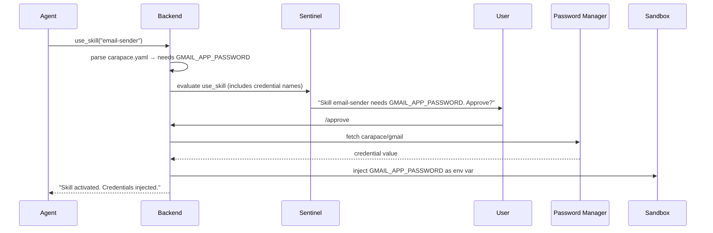
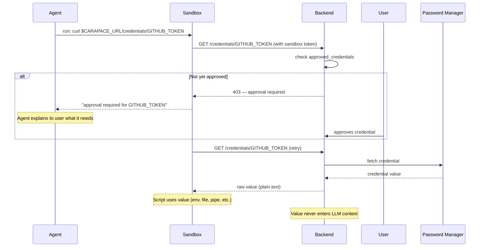

# Plan: Credential Management

> Status: planned. Currently only a `MockCredentialBroker` stub exists (unused). The credential system described below is the target design.

Carapace does not store credentials itself. It uses an external password manager as the single source of truth and exposes credentials to the sandbox via a REST endpoint that skill scripts pull from on demand.

## Design principle: pull, don't push

Instead of a complex broker that pushes credentials into containers, the backend exposes a simple HTTP endpoint on the same internal URL the sandbox already talks to for git operations. Skills fetch credentials themselves — the agent never sees raw values, and skill authors decide how to consume them (env var, file, pipe, etc.).

A built-in **credentials skill** documents this mechanism for the agent so it knows how to access and inject credentials when following a skill's instructions.

## System credentials

Only two credentials are needed by Carapace itself (stored as environment variables, not in the data directory):

- **LLM API token** (`CARAPACE_LLM_API_KEY`) — for the agent and sentinel models
- **Password manager auth** (`CARAPACE_VAULT_TOKEN`) — for accessing the password manager API

## Backend endpoints

New REST endpoints on the Carapace server, authenticated by the existing sandbox token:

### List / search credentials

```
GET /credentials
GET /credentials?q=gmail
Authorization: Bearer <SANDBOX_TOKEN>
```

Returns a JSON array of available credential names (and optionally vault paths) that match the query. **Does not return values** — only metadata. This lets the agent discover what credentials exist in the vault without exposing secrets.

Listing and searching are gated: the sentinel evaluates a `credential_list` action and can escalate. The user must approve before the agent (or a sandbox script) can browse the vault contents. Once approved, subsequent list/search calls in the same session are allowed without re-prompting.

### Fetch a credential

```
GET /credentials/{name}
Authorization: Bearer <SANDBOX_TOKEN>
```

The server:

1. Identifies the session from the sandbox token
2. Checks `approved_credentials` — if the credential is not yet approved, returns `403` with a message that approval is needed
3. Fetches the credential from the configured vault backend
4. Logs a `CredentialAccessEntry` to the session's action log
5. Returns the raw value in the response body (plain text, not JSON — easy to capture with `curl`)

The credential value passes through the server's memory but is **never written to disk or logged**.

## Skill credential declarations

Skills declare their credential needs in `carapace.yaml`:

```yaml
credentials:
  - name: GMAIL_APP_PASSWORD
    vault_path: "carapace/gmail"
    env_var: GMAIL_APP_PASSWORD
```

Each credential entry has:

| Field        | Description                                                                |
| ------------ | -------------------------------------------------------------------------- |
| `name`       | Identifier for the credential (used in approval prompts and session state) |
| `vault_path` | Path in the password manager                                               |
| `env_var`    | Environment variable name to inject as (optional — for auto-injection)     |

### Auto-injection on skill activation

When `use_skill` activates a skill whose `carapace.yaml` declares credentials with `env_var`:

1. The sentinel evaluates the credential access (names are included in the gate args) and the user approves
2. The backend fetches each credential from the vault
3. Values are injected as environment variables into the sandbox container for subsequent `exec()` calls
4. The agent and LLM never see the credential values — they are passed directly into the container runtime

This covers the common case where a skill just needs an API key available as an env var. For more complex scenarios (writing to a file, piping to stdin), the skill's instructions can tell the agent to use the REST endpoint directly.

## Credential flow

### Auto-injection (via `carapace.yaml`)



### On-demand fetch (via REST endpoint)



## Built-in credentials skill

A built-in skill (`credentials`) teaches the agent how the credential system works. Its `SKILL.md` documents:

- How to read a skill's `carapace.yaml` to discover required credentials
- That credentials declared with `env_var` are auto-injected when the skill is activated
- How to list available credentials: `carapace-cred list` or `carapace-cred list --query gmail` (requires approval on first use)
- How to fetch a credential via the REST endpoint (`curl -s $CARAPACE_URL/credentials/{name}`)
- A helper alias available in the sandbox: `carapace-cred get {name}` (wraps the curl call)
- How to inject a fetched value as an env var: `export THING=$(carapace-cred get THING)`
- That credential values must **never** be echoed, printed, or passed back to the agent

This way the agent learns the credential workflow from the skill's instructions — no special tool needed.

## Security properties

- **Credentials never enter LLM context**: Values stay inside the sandbox process. The agent orchestrates but never sees raw secrets.
- **No credential persistence**: The server never writes credentials to disk. They exist only in memory for the duration of a request.
- **Per-session approval**: Each credential must be approved the first time it is requested in a session. After `/reset`, all approvals are revoked.
- **Sentinel evaluation**: Credential access (both auto-injection and on-demand) is visible to the sentinel — it sees the credential names in tool args or shell commands and can escalate/deny.
- **Audit trail**: Every credential access is logged as a `CredentialAccessEntry` in the session action log and visible in Logfire traces.
- **Sandbox-scoped**: The REST endpoint is only reachable from inside the sandbox (authenticated by sandbox token). The credential is delivered to the container, not to the agent.

## UI: session credential visibility

The frontend displays credential state for the active session:

- **Session info panel**: Shows the list of approved credentials alongside existing fields (activated skills, allowed domains). Each credential shows its name and approval status.
- **Approval cards**: When credential approval is needed (either from auto-injection or an on-demand `403`), a `CredentialApprovalCard` component renders — same pattern as domain-access and git-push approval cards.
- **`/session` command**: Already returns `approved_credentials` — the frontend `CommandResultView` renders them in the session info display.

### WebSocket messages

- New `CredentialApprovalRequest` server message (mirrors `DomainAccessApprovalRequest`):
  ```typescript
  { type: "credential_approval_request", credential_name: string, skill_name?: string, explanation: string }
  ```
- The existing `StatusUpdate` or a new `SessionStateUpdate` message can push credential approvals to the UI in real-time so the session info panel stays current.

## Password manager backends

Supported backends:

| Backend                 | Integration                |
| ----------------------- | -------------------------- |
| Vaultwarden / Bitwarden | Via REST API               |
| 1Password               | Via CLI (`op`) or Connect  |
| `pass`                  | Unix password store        |
| Environment variables   | Fallback for simple setups |

The env-var backend is the natural starting point (zero dependencies). It resolves `vault_path` like `carapace/gmail` to an env var `CARAPACE_VAULT_CARAPACE_GMAIL` (uppercased, slashes replaced with underscores) on the server side.

Configuration in `config.yaml`:

```yaml
credentials:
  backend: env # or "vaultwarden", "1password", "pass"
  vaultwarden:
    url: https://vault.example.com
    # auth token via CARAPACE_VAULT_TOKEN env var
```

## Implementation notes

### What already exists

- `SessionState.approved_credentials` — list field, ready to track per-session approvals
- `SkillCarapaceConfig.credentials` — `carapace.yaml` parsing works (currently `list[dict[str, str]]` — should become a typed model)
- Sandbox token auth — the sandbox already authenticates to the backend for git
- Container env injection — `docker.py` `exec()` accepts `env: dict[str, str]`
- Domain approval pattern in `use_skill` — can be mirrored for credential gating

### What needs to be built

1. **Typed `SkillCredentialDecl` model** replacing `list[dict[str, str]]` in `SkillCarapaceConfig`
2. **`GET /credentials/{name}` endpoint** in `server.py` (vault fetch + approval check + logging)
3. **`GET /credentials` list/search endpoint** in `server.py` (metadata only, gated, no values)
4. **Vault backend interface** + env-var implementation
5. **Credential gating in `use_skill`** — extend the `_gate()` call to include credential names, inject approved values as env vars into sandbox
6. **`CredentialAccessEntry`** in `security/context.py` action log (covers both fetch and list/search)
7. **`CredentialApprovalRequest`** WebSocket message + frontend `CredentialApprovalCard` component
8. **Session info panel** in the frontend showing approved credentials
9. **Built-in `credentials` skill** with `SKILL.md` documenting the pull mechanism (including list/search)
10. **`carapace-cred` helper** baked into the sandbox image (`list`, `get` subcommands)

### Cleanup

- Remove `MockCredentialBroker` from `credentials.py` — it is unused and the pull-based design replaces it entirely
