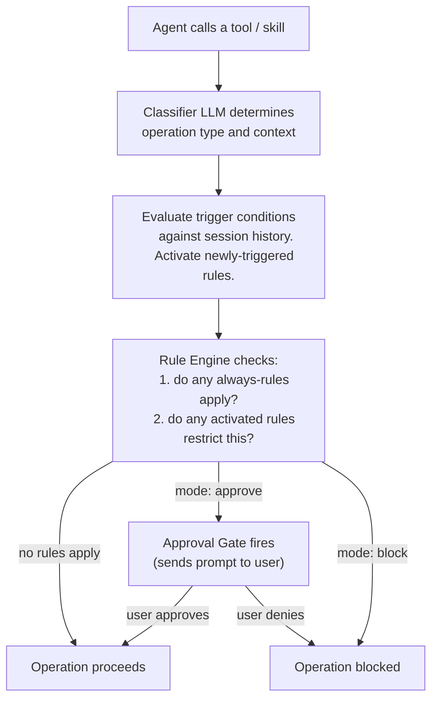

# Rule System

Rules are the central security primitive in Carapace. There are no permission matrices, no role-based access, no taint labels as a separate concept. The session state is simply **which rules have been activated** -- i.e., whose trigger condition was met based on what the agent has done so far. Each activated rule imposes a restriction for the remainder of the session unless the user disables it via slash command.

## How rules work

Every tool call and skill invocation passes through a pipeline before execution:

1. The **Operation Classifier** (a fast LLM call) analyzes what the operation does.
2. The **Rule Engine** checks whether any rule triggers have newly become true and activates them.
3. Already-activated rules are checked against the classified operation. If any match, the **Approval Gate** fires.
4. The Rule Engine uses the LLM to evaluate whether a plain-English rule _actually_ applies to this specific operation in context. This allows nuanced interpretation -- "writing to the internet" shouldn't trigger on a local DNS lookup.
5. Results are cached per `(rule_id, operation_signature)` for the session to avoid redundant LLM calls.



## Rule definition

Rules are defined in `$CARAPACE_DATA_DIR/rules.yaml` in plain English.

Each rule has:

- **`id`** -- unique identifier (used in slash commands, state tracking)
- **`trigger`** -- when the rule activates. Either `"always"` (active from session start) or a plain-English condition evaluated against session history
- **`effect`** -- what the rule restricts (plain English, evaluated by LLM against each operation)
- **`mode`** -- what happens when the rule applies:
  - `approve` -- pause the operation and ask the user
  - `block` -- deny outright (user can override with `/disable`)
- **`description`** -- human-readable explanation (shown in approval prompts and `/rules` output)

### Example rules

```yaml
rules:
  - id: no-write-after-web
    trigger: "the agent has read content from the internet"
    effect: "block all write operations (files, emails, APIs) without approval"
    mode: approve
    description: >
      If the agent has consumed unsanitized external input, it could
      be influenced by prompt injection. Write operations are gated
      until the user explicitly approves each one.

  - id: no-exfil-after-sensitive
    trigger: "the agent has accessed sensitive personal data (finances, documents, health)"
    effect: "block all outbound communication (email, API calls, messages) without approval"
    mode: approve
    description: >
      Prevents data exfiltration. After seeing sensitive data, the agent
      cannot send anything externally unless the user approves.

  - id: expense-write-always-approve
    trigger: "always"
    effect: "adding, modifying, or deleting entries in the finance database requires approval"
    mode: approve
    description: >
      Financial writes are always gated regardless of session state.

  - id: skill-modification
    trigger: "always"
    effect: "creating, editing, or deleting files in the skills folder requires approval"
    mode: approve
    description: >
      The agent can self-improve by writing skills, but every
      modification must be approved by the user.

  - id: memory-write
    trigger: "always"
    effect: "writing or modifying memory files requires approval"
    mode: approve
    description: >
      Memory is persistent context -- modifications should be deliberate.

  - id: shell-write
    trigger: "always"
    effect: "shell commands that write or execute (not read) require approval"
    mode: approve
    description: >
      Read-only shell commands (ls, cat, grep, find) in the base
      container are always allowed. Shell commands classified as
      write or execute operations require approval.

  - id: no-exfil-after-skill-read
    trigger: "the agent has read skill instructions (activated a skill)"
    effect: "block outbound communication (email, API calls) without approval"
    mode: approve
    description: >
      Skill instructions reveal the user's personal setup -- services,
      credential paths, workflow patterns. After reading these, outbound
      communication is gated to prevent information leakage.

  - id: credential-access
    trigger: "always"
    effect: "fetching any credential from the password manager requires approval on first use per session"
    mode: approve
    description: >
      Credentials are fetched from the password manager on demand.
      The user must approve each distinct credential the first time
      it is requested in a session.
```

## Rule modes

| Mode      | Behavior                                                                                                      |
| --------- | ------------------------------------------------------------------------------------------------------------- |
| `approve` | Operation is paused. User is asked to approve via their channel. Proceeds only on approval.                   |
| `block`   | Operation is denied outright. User can override by disabling the rule for the session (`/disable <rule-id>`). |

## Session state

Rule state is part of the session and persists across container restarts (but clears on `/reset`):

```yaml
activated_rules:
  - no-write-after-web
  - no-exfil-after-sensitive
disabled_rules:
  - memory-write
approved_operations:
  - "sha256:abc123..."
```

---

## Operation Classifier

The Classifier is the Rule Engine's input. It runs before every tool/skill invocation and produces a structured classification:

```python
class OperationClassification(BaseModel):
    operation_type: Literal[
        "read_local", "write_local",
        "read_external", "write_external",
        "read_sensitive", "write_sensitive",
        "execute", "credential_access",
        "memory_read", "memory_write",
        "skill_modify"
    ]
    categories: list[str]   # e.g. ["finance", "email", "documents"]
    description: str        # human-readable summary
    confidence: float
```

The Classifier receives:

- The tool/skill name and its manifest
- The arguments being passed
- For script-based skills: the actual command and its arguments

This replaces the need for skills to self-declare whether they are "read" or "write" (though `carapace.yaml` can include hints for performance). The LLM classifies dynamically, which handles novel skills the agent wrote itself.

The Classifier uses a fast model (Haiku-class or local) to keep latency low.

---

## Plan-Based Approval

To avoid approval fatigue, the agent always **plans before acting**. Rather than each step triggering individual approval prompts, the agent proposes a plan and then uses a built-in `request_approval` tool:

1. Takes the agent's plan as input
2. Pre-evaluates which rules would fire during execution
3. If no rules trigger: auto-approves, no user prompt needed
4. If rules trigger: sends **one consolidated approval request** listing all gated operations

### Example prompt

```
Plan Approval Required

The agent wants to execute the following plan:
1. Activate skill: expense-tracker (read_sensitive:finance)
2. Fetch credential: FINANCE_API_KEY
3. Run scripts/query.py to get Q4 expenses
4. Activate skill: email-sender (write_external)
5. Fetch credential: GMAIL_APP_PASSWORD
6. Run scripts/send.py to email summary to accountant@...

Rules that apply:
  - credential-access: FINANCE_API_KEY (first use)
  - credential-access: GMAIL_APP_PASSWORD (first use)
  - no-exfil-after-sensitive: steps 4-6 write externally after reading financial data

/approve all | /deny | /approve 1-3 only
```

The user can approve the entire plan, deny it, or approve a subset. During execution, the agent follows the approved plan without further prompts unless something unexpected happens.

### Why plan-based

A naive approach fires an approval prompt per operation. For a task that touches two skills and two credentials, that's four separate interruptions. Plan-based approval consolidates these into one interaction. The user sees the full picture and makes one decision.

If during execution the agent deviates from the approved plan (e.g., an error causes it to take an alternative path), a new approval cycle starts for the deviation.
