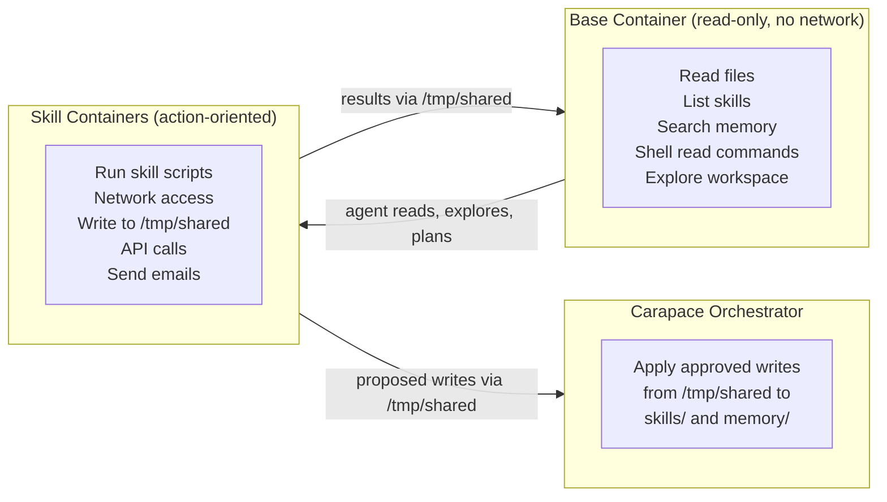

# Sandbox Architecture

All agent execution happens in Docker containers. Carapace itself (the orchestrator) runs on the host (or in its own container with the Docker socket mounted), but every tool invocation, script execution, and shell command runs inside containers.

## Two-tier execution model



### Base container

A pre-warmed, Alpine + Python container that serves as the agent's primary workspace:

- **Read-only mounts** for skills, memory, and workspace files
- **No network access** -- ever
- **Read-write access** only to `/tmp/shared` (session-scoped)

The agent can freely explore files, read skill catalogs, search memory, and run read-only shell commands (`ls`, `cat`, `grep`, `find`) here. Since it can't write to any persistent location or reach the network, there is minimal security risk -- the agent can look at everything without being able to act on it or leak it.

Shell commands classified as write or execute operations trigger the `shell-write` rule and require approval before the command runs.

### Skill containers

Where all _actions_ happen. Each skill with a `Dockerfile` gets its own container image, built and cached by Carapace. Skills without a `Dockerfile` use a default sandbox image (generic Python + common tools).

Skill containers can have:

- **Network access** -- per skill, declared in `carapace.yaml` (`sandbox.network: true`)
- **Credentials** -- injected as environment variables by the Credential Broker
- **Write access** to `/tmp/shared` -- for results and proposed writes

## Shared mounts

All containers (base and skill) get the same set of mounts:

| Mount source                            | Container path | Mode       |
| --------------------------------------- | -------------- | ---------- |
| `$CARAPACE_DATA_DIR/skills/`            | `/skills`      | read-only  |
| `$CARAPACE_DATA_DIR/memory/`            | `/memory`      | read-only  |
| `$CARAPACE_DATA_DIR/` (workspace files) | `/workspace`   | read-only  |
| `$CARAPACE_DATA_DIR/tmp/<session_id>`   | `/tmp/shared`  | read-write |

The workspace mount (`/workspace`) exposes the top-level files: `AGENTS.md`, `SOUL.md`, `USER.md`, `TOOLS.md`, `HEARTBEAT.md`, `config.yaml`, `rules.yaml`.

## Shared temp directory

`/tmp/shared` is the only writable mount, scoped per session. It serves three purposes:

1. **Inter-container data exchange** -- a skill script writes `result.json`, the base container reads it
2. **Proposed writes** -- the agent writes to `/tmp/shared/pending/{memory,skills}/...`, the orchestrator applies after approval
3. **Scratch space** -- temporary files during computation

## How writes work

The base container and skill containers both mount `skills/` and `memory/` as read-only. When the agent wants to write (to memory, skills, or workspace files):

1. Agent writes the proposed content to `/tmp/shared/pending/<target_path>`
2. The write triggers the relevant rule (`memory-write`, `skill-modification`, etc.)
3. Approval request is sent to the user showing exactly what will be written
4. On approval, the **Carapace orchestrator** (running on the host) copies the files from the pending directory to the actual location
5. The pending directory is cleaned up

This keeps containers truly read-only while still allowing gated writes.

## Network policy

| Container                                       | Network         |
| ----------------------------------------------- | --------------- |
| Base container                                  | Blocked, always |
| Skill containers (default)                      | Blocked         |
| Skill containers (with `sandbox.network: true`) | Allowed         |

Network access for skill containers is declared per-skill in `carapace.yaml`. The default is no network.

## Container lifecycle

- **Base container**: Pre-warmed at session start (created when the session begins, kept running). Shell commands execute via `docker exec` into this running container. Destroyed after idle timeout.
- **Skill containers**: Created on first invocation of that skill within a session. Kept running for reuse within the session. Destroyed after idle timeout.
- **Idle timeout**: Configurable (default: 15 min). After timeout, all containers for a session are destroyed. Sessions themselves persist (history, state) -- only containers are ephemeral.
- **Pre-warming**: When the user sends a new message after containers expired, a new base container is created immediately. This introduces some latency on the first message after idle, but subsequent operations are fast.

## Docker socket

Carapace needs access to the Docker socket to orchestrate containers. In a Docker Compose deployment, this means mounting `/var/run/docker.sock`:

```yaml
services:
  carapace:
    volumes:
      - /var/run/docker.sock:/var/run/docker.sock
```

The orchestrator uses the Docker SDK for Python (docker-py) to manage container lifecycle, image builds, and `docker exec` commands.
