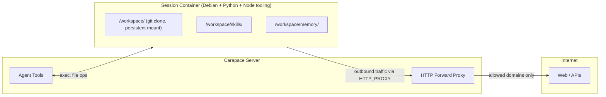

# Sandbox Architecture

All agent tool invocations — script execution, shell commands, file operations — run inside a sandboxed container. Carapace itself (the server) runs on the host (or in its own container/pod), but every agent action runs inside an isolated container.

## Execution model

Each session gets a single sandbox container. The container provides the agent with a workspace where it can read files, run commands, and interact with skills.


```mermaid
flowchart LR
    subgraph carapace [Carapace Server]
        Agent[Agent Tools]
        Proxy[HTTP Forward Proxy]
    end

    subgraph container ["Session Container (Debian + Python + Node tooling)"]
        Workspace["/workspace/ (git clone, persistent mount)"]
        Skills["/workspace/skills/"]
        Memory["/workspace/memory/"]
    end

    subgraph external [Internet]
        APIs[Web / APIs]
    end

    Agent <-->|exec, file ops| container
    container -->|outbound traffic via HTTP_PROXY| Proxy
    Proxy -->|allowed domains only| APIs
```

### Container capabilities

- **Shell access**: The agent runs commands via `exec` (equivalent to `docker exec` / `kubectl exec`)
- **File operations**: `read`, `write`, `str_replace` work directly on the container filesystem
- **Network access**: All outbound traffic goes through the HTTP forward proxy, which enforces per-session domain allowlisting
- **Skills**: Activated skills are available in the cloned knowledge repo; automatic setup can run Python, Node, and `setup.sh` providers
- **Workspace files**: `SOUL.md`, `USER.md`, `SECURITY.md` etc. live in the knowledge repo at `/workspace/`. Changes are persisted via `git commit` and `git push`.

## Mounts

When a session container is created, the following mounts are configured:

### Docker mode

| Host source | Container path | Mode | Purpose |
| --- | --- | --- | --- |
| `sessions/{sid}/workspace/` | `/workspace/` | read-write | Persistent session workspace |

### Kubernetes mode (StatefulSet)

Each session gets its own PVC via the StatefulSet's `volumeClaimTemplates`:

| Volume | Container path | Mode | Purpose |
| --- | --- | --- | --- |
| `session-data` (per-session PVC) | `/workspace/` | read-write | Persistent session workspace |

No shared PVC access — the server's data PVC is `ReadWriteOnce`.

The knowledge repo is cloned directly into `/workspace/` on first start. On container restarts the existing working tree is reused. To persist changes back to the server, the agent uses `git commit` and `git push` inside `/workspace/` — every push is evaluated by the security sentinel via a pre-receive hook.

## Network policy

All outbound traffic from sandbox containers is routed through the Carapace server's HTTP forward proxy:

- Containers receive only `HTTP_PROXY` / `HTTPS_PROXY` environment variables pointing to the proxy
- No direct internet access — enforced by Docker network isolation or Kubernetes NetworkPolicy
- The proxy uses per-session token-based authentication (injected as `Proxy-Authorization` via environment setup script)

### Domain allowlisting

Each session maintains a domain allowlist. Domains are added when:

1. **Skill activation**: Domains declared in a skill's `carapace.yaml` (`network.domains`) are registered when the skill is activated and applied to commands that explicitly use that skill's context
2. **Sentinel approval**: Unknown domains are evaluated by the sentinel. If allowed, they're added for the current exec call. If escalated, the user decides.
3. **Proxy bypass**: During automatic dependency installation (`uv sync --locked`, `npm ci`, `pnpm install --frozen-lockfile`, `yarn install --immutable`), the proxy is temporarily bypassed to allow package downloads

The proxy supports exact domain matching (`example.com`) and wildcard matching (`*.example.com`).

## Container lifecycle

- **Creation**: A container is created (or ensured running) when a session needs it — typically on the first tool call
- **Reuse**: The container stays running for the session's duration. Multiple tool calls reuse the same container.
- **Idle timeout**: Configurable (default: 15 min). In Docker mode, idle containers are destroyed. In Kubernetes mode, the StatefulSet is scaled to 0 replicas — the PVC is retained, so venvs and workspace state survive.
- **Re-warming**: When the user sends a new message after the container expired, a new container is created (Docker: fresh container with same bind mounts; Kubernetes: StatefulSet scaled back to 1 replica, PVC still attached). Carapace restores committed provider files from the pushed upstream revision and reruns the matching automatic setup providers for activated skills. Approved skill credentials are made available before that setup runs so `setup.sh` can materialize local config files if needed.
- **Reset** (`/reload`): Fully destroys the container and workspace (including the PVC in Kubernetes mode) and creates a fresh sandbox with a new git clone on the next command.

## Runtimes

Carapace supports two sandbox runtimes, configured via `CARAPACE_SANDBOX_RUNTIME`:

### Docker

The default runtime. Uses the Docker socket (`/var/run/docker.sock`) to manage containers. Sandbox containers run on an internal Docker network (`carapace-sandbox`) with no direct internet access.

### Kubernetes

For cluster deployments. Sandbox sessions run as Kubernetes StatefulSets with per-session PVCs (via `volumeClaimTemplates`). Commands are executed via the Kubernetes exec API. On idle timeout the StatefulSet is scaled to 0 replicas (PVC retained); on resume it's scaled back to 1. See [kubernetes.md](kubernetes.md) for full details.

Both runtimes implement the same `ContainerRuntime` interface, so the rest of Carapace doesn't need to know which backend is in use.

## Docker socket

In Docker mode, Carapace needs access to the Docker socket:

```yaml
services:
  carapace:
    volumes:
      - /var/run/docker.sock:/var/run/docker.sock
```

The server uses the Docker SDK for Python to manage container lifecycle, and `docker exec` for command execution.
