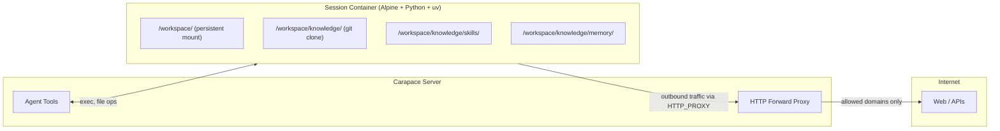

# Sandbox Architecture

All agent tool invocations — script execution, shell commands, file operations — run inside a sandboxed container. Carapace itself (the server) runs on the host (or in its own container/pod), but every agent action runs inside an isolated container.

## Execution model

Each session gets a single sandbox container. The container provides the agent with a workspace where it can read files, run commands, and interact with skills.


```mermaid
flowchart LR
    subgraph carapace [Carapace Server]
        Agent[Agent Tools]
        Proxy[HTTP Forward Proxy]
    end

    subgraph container ["Session Container (Alpine + Python + uv)"]
        Workspace["/workspace/ (persistent mount)"]
        Knowledge["/workspace/knowledge/ (git clone)"]
        Skills["/workspace/knowledge/skills/"]
        Memory["/workspace/knowledge/memory/"]
    end

    subgraph external [Internet]
        APIs[Web / APIs]
    end

    Agent <-->|exec, file ops| container
    container -->|outbound traffic via HTTP_PROXY| Proxy
    Proxy -->|allowed domains only| APIs
```

### Container capabilities

- **Shell access**: The agent runs commands via `exec` (equivalent to `docker exec` / `kubectl exec`)
- **File operations**: `read`, `write`, `edit`, `apply_patch` work directly on the container filesystem
- **Network access**: All outbound traffic goes through the HTTP forward proxy, which enforces per-session domain allowlisting
- **Skills**: Activated skills are available in the cloned knowledge repo; venvs are built via `uv sync`
- **Workspace files**: `SOUL.md`, `USER.md`, `SECURITY.md` etc. live in the knowledge repo clone. Changes are persisted via `git commit` and `git push`.

## Mounts

When a session container is created, the following mounts are configured:

| Host source | Container path | Mode | Purpose |
| --- | --- | --- | --- |
| `sessions/{sid}/workspace/` | `/workspace/` | read-write | Persistent session workspace |

The knowledge repo is cloned into `/workspace/knowledge/` on first start. On container restarts the existing working tree is reused. To persist changes back to the server, the agent uses `git commit` and `git push` inside `/workspace/knowledge/` — every push is evaluated by the security sentinel via a pre-receive hook.

## Network policy

All outbound traffic from sandbox containers is routed through the Carapace server's HTTP forward proxy:

- Containers receive only `HTTP_PROXY` / `HTTPS_PROXY` environment variables pointing to the proxy
- No direct internet access — enforced by Docker network isolation or Kubernetes NetworkPolicy
- The proxy uses per-session token-based authentication (injected as `Proxy-Authorization` via environment setup script)

### Domain allowlisting

Each session maintains a domain allowlist. Domains are added when:

1. **Skill activation**: Domains declared in a skill's `carapace.yaml` (`network.domains`) are automatically added when the skill is activated
2. **Sentinel approval**: Unknown domains are evaluated by the sentinel. If allowed, they're added for the current exec call. If escalated, the user decides.
3. **Proxy bypass**: During skill venv builds (`uv sync`), the proxy is temporarily bypassed to allow package downloads

The proxy supports exact domain matching (`example.com`) and wildcard matching (`*.example.com`).

## Container lifecycle

- **Creation**: A container is created (or ensured running) when a session needs it — typically on the first tool call
- **Reuse**: The container stays running for the session's duration. Multiple tool calls reuse the same container.
- **Idle timeout**: Configurable (default: 15 min). After timeout, containers are destroyed. Sessions themselves persist (history, state) — only containers are ephemeral.
- **Re-warming**: When the user sends a new message after containers expired, a new container is created with the same mounts. Activated skill venvs are rebuilt automatically.

## Runtimes

Carapace supports two sandbox runtimes, configured via `CARAPACE_SANDBOX_RUNTIME`:

### Docker

The default runtime. Uses the Docker socket (`/var/run/docker.sock`) to manage containers. Sandbox containers run on an internal Docker network (`carapace-sandbox`) with no direct internet access.

### Kubernetes

For cluster deployments. Sandbox sessions run as Kubernetes pods with commands executed via the Kubernetes exec API. See [kubernetes.md](kubernetes.md) for full details.

Both runtimes implement the same `SandboxRuntime` interface, so the rest of Carapace doesn't need to know which backend is in use.

## Docker socket

In Docker mode, Carapace needs access to the Docker socket:

```yaml
services:
  carapace:
    volumes:
      - /var/run/docker.sock:/var/run/docker.sock
```

The server uses the Docker SDK for Python to manage container lifecycle, and `docker exec` for command execution.
