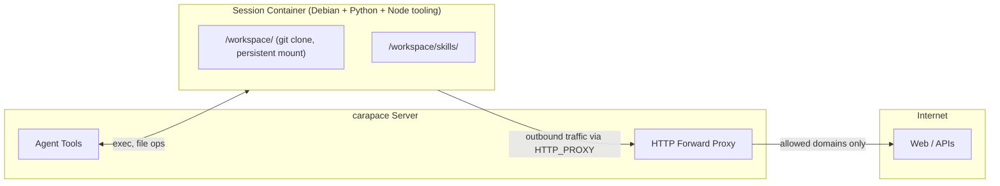

# Sandbox Architecture

All agent tool invocations — script execution, shell commands, file operations — run inside a sandboxed container. carapace itself (the server) runs on the host (or in its own container/pod), but every agent action runs inside an isolated container.

## Execution model

Each session resolves to a logical sandbox identified by `sandbox_id`. By default that ID matches the session ID. When the Kubernetes warm pool is enabled, a session may instead claim a prestarted generic sandbox with a unique id such as `pool-3f9c…`, so `sandbox_id` and `session_id` can differ. The sandbox inspector in the web UI surfaces that current `sandbox_id` so claimed warm sandboxes are visible.

The active sandbox provides the agent with a workspace where it can read files, run commands, and interact with skills.


```mermaid
flowchart LR
    subgraph carapace [carapace Server]
        Agent[Agent Tools]
        Proxy[HTTP Forward Proxy]
    end

    subgraph container ["Session Container (Debian + Python + Node tooling)"]
        Workspace["/workspace/ (git clone, persistent mount)"]
        Skills["/workspace/skills/"]
    end

    subgraph external [Internet]
        APIs[Web / APIs]
    end

    Agent <-->|exec, file ops| container
    container -->|outbound traffic via HTTP_PROXY| Proxy
    Proxy -->|allowed domains only| APIs
```

### Container capabilities

- **Shell access**: The agent runs commands via `exec` (equivalent to `docker exec` / `kubectl exec`)
- **File operations**: `read`, `write`, `str_replace` work directly on the container filesystem
- **Network access**: All outbound traffic goes through the HTTP forward proxy, which enforces per-session domain allowlisting
- **Skills**: Activated skills are available in the cloned knowledge repo; the configured sandbox activator prepares their runtimes
- **Workspace files**: `SOUL.md`, `USER.md`, `SECURITY.md` etc. live in the knowledge repo at `/workspace/`. Changes are persisted via `git commit` and `git push`.

## Mounts

When a session container is created, the following mounts are configured:

### Docker mode

| Host source                 | Container path | Mode       | Purpose                      |
| --------------------------- | -------------- | ---------- | ---------------------------- |
| `sessions/{sid}/workspace/` | `/workspace/`  | read-write | Persistent session workspace |

### Kubernetes mode (StatefulSet)

Each session gets its own PVC via the StatefulSet's `volumeClaimTemplates`:

| Volume                           | Container path | Mode       | Purpose                      |
| -------------------------------- | -------------- | ---------- | ---------------------------- |
| `session-data` (per-session PVC) | `/workspace/`  | read-write | Persistent session workspace |
| `session-data` (per-session PVC) | `/tmp/`        | read-write | Persistent temp files        |

No shared PVC access — the server's data PVC is `ReadWriteOnce`.

The knowledge repo is cloned directly into `/workspace/` on first start. On container restarts the existing working tree is reused. `/tmp/` is backed by the same per-session PVC via a separate `subPath`, so temp artifacts also survive suspend and resume without provisioning a second claim. To persist changes back to the server, the agent uses `git commit` and `git push` inside `/workspace/`. Every push is evaluated by the security sentinel via a pre-receive hook.

## Custom sandbox skill activator contract

A sandbox image may provide one executable that prepares a complete skill runtime and optionally overrides its declared command aliases. Configure its absolute in-container path on the server:

```text
CARAPACE_SANDBOX_SKILL_ACTIVATOR=/usr/local/bin/carapace-skill-activator
CARAPACE_SANDBOX_SKILL_ACTIVATOR_TIMEOUT_SECONDS=600
```

An unset or empty path disables automatic runtime preparation while preserving declared command aliases. A configured path that is missing or not executable fails automatic setup. The path must be outside `/workspace`, `/tmp`, `/var/tmp`, and `/dev/shm`.

Carapace invokes the executable once per skill with `--request-base64` followed by a base64-encoded JSON object:

```json
{
  "protocol_version": 1,
  "skill": "web",
  "skill_dir": "/workspace/skills/web",
  "workspace": "/workspace",
  "source_revision": "0123456789abcdef0123456789abcdef01234567",
  "commands": [
    {
      "name": "web_search",
      "command": "uv run --directory /workspace/skills/web web_search"
    }
  ]
}
```

`source_revision` is the exact committed knowledge-repository object ID selected by core. The live workspace remains writable and may contain later or uncommitted changes. The activator must select any automatically executed input from `source_revision`. It decides which files to restore or how to consume that revision. Core never resets the complete skill directory.

On success, the executable exits zero and writes exactly one marked JSON line to stdout:

```text
@@CARAPACE_SKILL_ACTIVATOR@@{"protocol_version":1,"command_overrides":{"web_search":"/nix/store/.../bin/web_search"},"messages":["Realized web commands."]}
```

`command_overrides` may contain only aliases present in `commands`. Omitted aliases keep their declared commands. Commands and messages must be nonempty single-line strings. Messages are model-facing and must not contain credentials or raw package-manager and hook output.

On failure, the executable exits nonzero. It may emit one marked response with a safe error:

```text
@@CARAPACE_SKILL_ACTIVATOR@@{"protocol_version":1,"error":"runtime realization failed with status 1"}
```

Carapace rejects unknown versions, malformed responses, undeclared aliases, invalid command strings, and invocations exceeding the configured timeout. It validates the full response before installing command shims. Activator filesystem side effects are not rolled back.

The activator runs after `use_skill` approval with the skill's successfully resolved `env_var` and `file` credentials, plus the same proxy bypass used by the previous built-in setup providers. Credentials are not part of the JSON request. File credentials are removed after invocation.

The executable is trusted deployment code. Its integrity is the sandbox image operator's responsibility. Use an immutable image path, read-only mount, Nix store path, or a non-root sandbox user with root-owned activator files. Carapace validates the configured path but does not enforce a read-only container root.

The official image installs `/usr/local/bin/carapace-skill-activator`. It restores matching provider inputs from `source_revision`, then preserves the former uv, npm, pnpm, and `setup.sh` behavior. Custom images need only implement the versioned process contract above.

## Network policy

All outbound traffic from sandbox containers is routed through the carapace server's HTTP forward proxy:

- Containers receive only `HTTP_PROXY` / `HTTPS_PROXY` environment variables pointing to the proxy
- No direct internet access — enforced by Docker network isolation or Kubernetes NetworkPolicy
- The proxy uses per-session token-based authentication (injected as `Proxy-Authorization` via environment setup script)

### Domain allowlisting

Each session maintains a domain allowlist. Domains are added when:

1. **Skill activation**: Domains declared in a skill's `SKILL.md` frontmatter under `metadata.carapace.network.domains` are registered when the skill is activated and applied to commands that explicitly use that skill's context.
2. **Sentinel approval**: Unknown domains are evaluated by the sentinel. If allowed, they're added for the current exec call. If escalated, the user decides.
3. **Proxy bypass**: During sandbox-provided skill activation, the proxy is temporarily bypassed. The official activator selects and restores its executable inputs from the committed `source_revision` before running uv, npm, pnpm, or `setup.sh`.

The proxy supports exact domain matching (`example.com`) and wildcard matching (`*.example.com`).

### Exec-scoped TCP tunnels

Skills may also declare `network.tunnels` in their `metadata.carapace` config. These are not long-running session daemons. Instead, carapace manages them around a single `exec` call:

1. Before the command runs, carapace temporarily shadows the declared hostnames inside the sandbox.
2. It starts trusted TCP forwarders inside the sandbox that use the existing HTTP CONNECT proxy to reach the remote `host:remote_port` endpoints.
3. The user command runs.
4. In `finally`, carapace stops the forwarders and restores the original host resolution.

Important semantics:

- Tunnels are exec-scoped, not session-scoped.
- Tunnel hosts must be exact hostnames; wildcards are not allowed.
- The client should keep using the original hostname so TLS validation and SNI continue to work.
- `network.domains` and `network.tunnels` may overlap on the same hostname.
- Proxy-aware HTTP and HTTPS to the same hostname still work through the normal proxy path.
- Direct socket connections to the tunneled hostname are shadowed for the duration of that exec, even on other ports.

## Container lifecycle

- **Creation**: A container is created (or ensured running) when a session needs it — typically on the first tool call
- **Reuse**: The container stays running for the session's duration. Multiple tool calls reuse the same container.
- **Idle timeout**: Configurable (default: 60 min). In Docker mode, idle containers are destroyed. In Kubernetes mode, the StatefulSet is scaled to 0 replicas — the PVC is retained, so venvs and workspace state survive.
- **Warm pool**: If `CARAPACE_SANDBOX_WARM_POOL_SIZE > 0`, carapace maintains that many unattached base-image sandboxes ahead of time. On Kubernetes, new sessions claim one of these warm sandboxes before falling back to cold creation. The claimed sandbox keeps its own unique `sandbox_id` (for example `pool-3f9c…`) while still being attached to the session.
- **Re-warming**: When the user sends a new message after the container expired, a new container is created (Docker: fresh container with the same bind mounts; Kubernetes: StatefulSet scaled back to 1 replica, PVC still attached). Carapace reruns the configured activator for each active skill and restores command shims. Approved skill credentials are made available before activation.
- **Reset** (`/reload`): Fully destroys the container and workspace (including the PVC in Kubernetes mode) and creates a fresh sandbox with a new git clone on the next command.

## Runtimes

carapace supports two sandbox runtimes, configured via `CARAPACE_SANDBOX_RUNTIME`:

### Docker

The default runtime. Uses the Docker socket (`/var/run/docker.sock`) to manage containers. Sandbox containers run on an internal Docker network (`carapace-sandbox`) with no direct internet access.

### Kubernetes

For cluster deployments. Sandbox sessions run as Kubernetes StatefulSets with per-session PVCs (via `volumeClaimTemplates`). Commands are executed via the Kubernetes exec API. On idle timeout the StatefulSet is scaled to 0 replicas (PVC retained); on resume it's scaled back to 1. The warm-pool claim path is currently implemented here: generic prestarted base sandboxes can be claimed for new sessions when `CARAPACE_SANDBOX_WARM_POOL_SIZE` is set. See [kubernetes.md](kubernetes.md) for full details.

Both runtimes implement the same `ContainerRuntime` interface, so the rest of carapace doesn't need to know which backend is in use.

## Docker socket

In Docker mode, carapace needs access to the Docker socket:

```yaml
services:
  carapace:
    volumes:
      - /var/run/docker.sock:/var/run/docker.sock
```

The server uses the Docker SDK for Python to manage container lifecycle, and `docker exec` for command execution.
