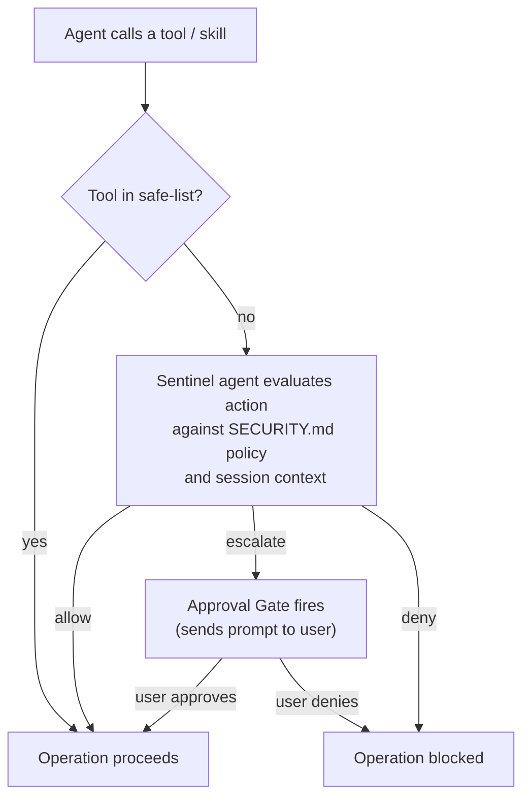

# Security System

carapace gates every agent action through a two-layer security system: a fast **safe-list** bypass for known-harmless operations, and an LLM-powered **sentinel agent** for everything else. The sentinel maintains a persistent conversation per session, evaluating each action against a natural-language security policy and the full history of what happened so far.

## How it works

Every tool call and skill invocation passes through the security module before execution:

1. **Safe-list check.** A hardcoded set of tool names (file reads/writes/replacements in the sandbox, skill listing) is auto-allowed without any LLM call.
2. **Sentinel evaluation.** All other operations are sent to the sentinel agent -- an LLM that receives the action log, the tool name and arguments, and makes a contextual decision.
3. **Verdict.** The sentinel returns one of three decisions:
   - **allow** -- proceed without interruption.
   - **escalate** -- pause the operation and ask the user for approval.
   - **deny** -- block the operation outright.
4. **Audit.** Every decision (safe-list or sentinel) is recorded in a per-session audit log.

## SECURITY.md -- the policy file

The security policy lives in `$CARAPACE_DATA_DIR/SECURITY.md`. It is written in plain English and becomes part of the sentinel agent's system prompt. There are no rigid YAML rules to parse -- the sentinel interprets the policy with full LLM understanding.

The shipped default policy (see `src/carapace/assets/SECURITY.md`) covers:

- **Default stance** -- assume the agent is usually doing the right thing; escalate for genuine ambiguity or risk, not routine work; deny when listed threats clearly apply; the user may instruct the sentinel how to treat a specific next step (within hard safety limits).
- **Threats** -- prompt injection, destructive or absurd approaches, task drift, unsafe handling of passwords.
- **Sandbox and layered defense** -- local `exec` is judged in context; network and Git push provide a second line of defense, but obviously malicious commands should still be stopped early.
- **Network (proxy)** -- TLS hides everything except the domain; higher bar for outbound than inbound; judge plausibility from the triggering command and conversation.
- **Skill activation** -- permissive `use_skill`; lighter touch when the skill injects no credentials; skill-declared vault paths are covered by `use_skill` approval (no extra prompt by design).
- **Credentials** -- explicit sandbox vault access must fit the user’s task; deny exfiltration-style patterns; secrets must never be echoed or logged in plain text.
- **Git push** -- always escalate when `USER.md`, `SOUL.md`, `AGENTS.md`, or `SECURITY.md` change; other files may be allowed when the chat clearly shows user intent.
- **Autonomy** -- slightly more care after long unsupervised stretches or fresh external content, without escalating every harmless step.
- **Proxy domain requests** -- plausibility pass on domains after the tool call that triggered the connection was already evaluated.

Edit `SECURITY.md` to customize the policy for your setup. The sentinel will immediately pick up changes on the next session.

## Safe-list

The following tools are auto-allowed without consulting the sentinel:

| Tool          | Reason                                    |
| ------------- | ----------------------------------------- |
| `read`        | File reads are always safe                |
| `write`       | File writes in the sandbox                |
| `str_replace` | String replacement edits in sandbox files |
| `list_skills` | Listing available skills is informational |

`use_skill` is **not** safe-listed: activating a skill (copy into sandbox, optional venv sync, credential injection) is evaluated by the sentinel like other gated tools.

The safe-list is defined in `src/carapace/security/__init__.py`.

## The sentinel agent

The sentinel is a Pydantic AI agent with its own LLM model (configured as `agent.sentinel_model` in `config.yaml`). It has two key properties:

### Shadow conversation

Instead of stateless per-call evaluations, the sentinel maintains a **persistent conversation** for each session. Each evaluation request is appended as a new message to the ongoing conversation, giving the sentinel full context of:

- All previous tool calls and their decisions
- User messages and agent responses (metadata only -- not raw tool results, to prevent prompt injection)
- Previous approvals and denials
- Skill activations

This enables nuanced judgments like "the user just confirmed this is what they want" or "the agent has been running autonomously for a while after reading external data."

The sentinel's conversation is periodically reset (configurable via `reset_threshold`) to prevent unbounded context growth. On reset, the full action log is summarized into the first message of the new conversation.

### Restricted tool access

The sentinel has read-only access to **skill directories** via two tools:

- `list_skill_files(skill_name)` -- list files in a skill directory.
- `read_skill_file(skill_name, path)` -- read a specific skill file.

This lets the sentinel inspect trusted skill code to understand what a tool invocation will actually do. Crucially, the sentinel **cannot** read the main agent's workspace -- files there may have been written by the agent and could contain prompt injection attempts.

## Action log

The action log is a per-session, append-only chronological record of all significant events:

| Entry type              | What it records                                             |
| ----------------------- | ----------------------------------------------------------- |
| `UserMessageEntry`      | User sent a message (truncated preview)                     |
| `AgentResponseEntry`    | Agent generated a response (token count only)               |
| `ToolCallEntry`         | Tool was called, with decision and explanation              |
| `ToolResultEntry`       | Tool returned a result (metadata only, not content)         |
| `ApprovalEntry`         | User approved or denied an escalated action                 |
| `SkillActivatedEntry`   | A skill was activated (metadata only)                       |
| `UserVouchedEntry`      | User explicitly vouched for context via `/approve-context`  |
| `GitPushEntry`          | Git push evaluated by sentinel (ref, decision, explanation) |
| `CredentialAccessEntry` | Credential access attempt (vault paths, decision)           |

The action log serves as the sentinel's primary source of truth. Raw tool results are never included -- only their metadata (size, success/failure) -- to prevent prompt injection via tool output.

This action log is distinct from both runtime session transcripts:

- `history.yaml` stores the raw model conversation state (`ModelMessage` history) for the main agent.
- `events.yaml` stores the user-facing session transcript and operational events used by the UI, retry/reset/fork flows, and knowledge export.
- `audit.yaml` stores security decisions and sentinel verdicts for auditability.

## Credential access

Credential access is mediated through the sandbox API and session state:

- Sandbox scripts use `ccred` (or direct HTTP) to call `GET /credentials` and `GET /credentials/{vault_path}`.
- `list` / `search` expose metadata only and are security-reviewed at the `exec` tool-call layer.
- `fetch` is per-session approval-based: if a credential is not yet approved for the session, carapace sends a credential approval request and blocks until approve/deny.
- Approved credential metadata is tracked via context grants in `SessionState.context_grants` and reflected in `/session`.
- Credential access decisions are recorded as `CredentialAccessEntry` action-log events.

As with the rest of carapace's model, the "keep secrets out of model output" guarantee is defense-in-depth: policy + sentinel + agent behavior. It is not a protocol-level cryptographic boundary, so secret-echoing commands must remain prohibited.

## Audit log

Every security decision is written to a per-session audit log file at `$CARAPACE_DATA_DIR/sessions/<session_id>/audit.yaml`. Each entry includes:

- Timestamp
- Whether it was a tool call, proxy domain request, or git push
- The sentinel's verdict (decision, explanation, risk level)
- The final decision (may differ if user overrode an escalation)

## Proxy domain requests

When a sandboxed container makes a network request, the proxy intercepts it and routes the domain to the security module. The sentinel evaluates whether the domain makes sense given the approved tool call that triggered it:

- A `curl` to `api.github.com` when running a git command → expected.
- A Python script connecting to an unrelated domain not mentioned in the task → suspicious.

The sentinel's system prompt explicitly tells it that the tool call itself was already approved -- domain checks are a plausibility/safety-net layer, not a second full evaluation.

## Git push evaluation

When the agent pushes changes from a sandbox container back to the knowledge repository, the push is gated by a **pre-receive hook** that routes each ref update through the sentinel. The sentinel sees the branch, commit log, and diff, and decides whether to allow the push.

Like tool calls and proxy domains, the sentinel can escalate a git push to the user for approval. Push evaluation results (allow, deny, escalate) are broadcast to all session subscribers (WebSocket, Matrix) and recorded in both the action log (`GitPushEntry`) and the audit log.

If a push is denied, `git push` fails in the sandbox with a descriptive error message from the sentinel.

If an external remote is configured (`git.remote` in config), a successful push from the sandbox is automatically forwarded to the remote. Users can also trigger this manually with the `/push` slash command.

If the sentinel escalates a domain request, it is forwarded to the user through their channel (WebSocket, Matrix).

## Veto semantics

carapace follows strict veto semantics: if **any** part of the security system says "no" (or "needs approval"), that decision is final. This means:

- A safe-list bypass cannot override a sentinel denial (safe-list only applies to its own set of tools).
- The sentinel cannot override a deterministic denial from the safe-list check (which denies nothing -- it only auto-allows).
- A user denial on an escalated action is always final.

This makes the system easy to reason about: the strictest judgment always wins.

## Slash commands

Users can interact with the security system through slash commands:

| Command            | Description                                                                           |
| ------------------ | ------------------------------------------------------------------------------------- |
| `/security`        | Show the current security policy and a summary of the action log                      |
| `/approve-context` | Record a `UserVouchedEntry` in the action log, signaling trust in the current context |

## Prompt injection hardening

The sentinel is designed to resist prompt injection:

1. **No raw tool results.** The sentinel never sees file contents, API responses, or command output -- only metadata about the results.
2. **Adversarial awareness.** The sentinel's system prompt includes explicit warnings about prompt injection attempts in action log entries.
3. **Restricted file access.** The sentinel can only read trusted skill directories, not the agent's potentially compromised workspace.
4. **Structured output.** The sentinel returns a `SentinelVerdict` Pydantic model, not free-form text, reducing the attack surface for output manipulation.
